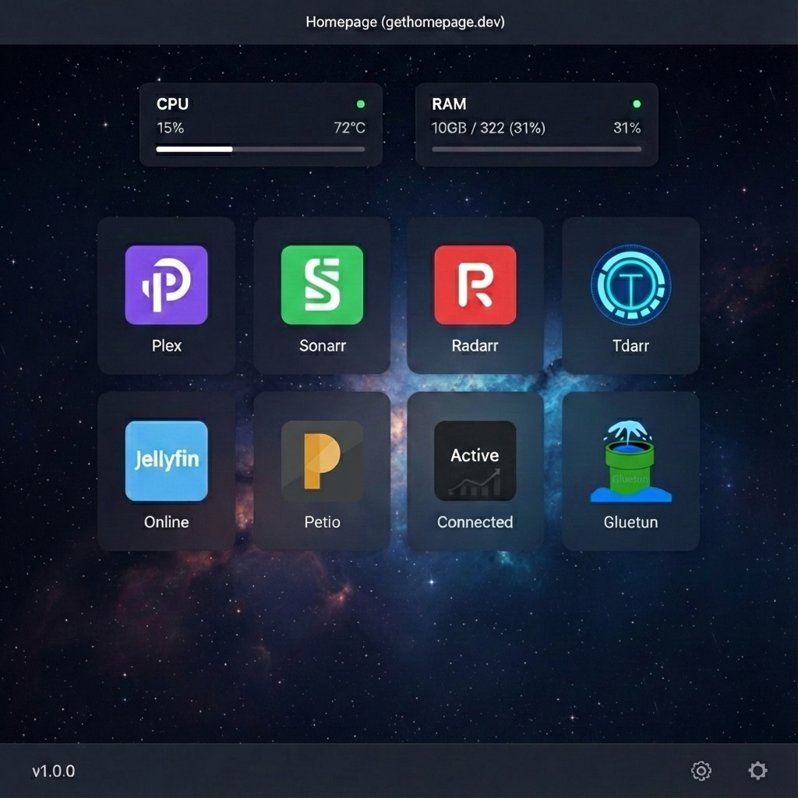
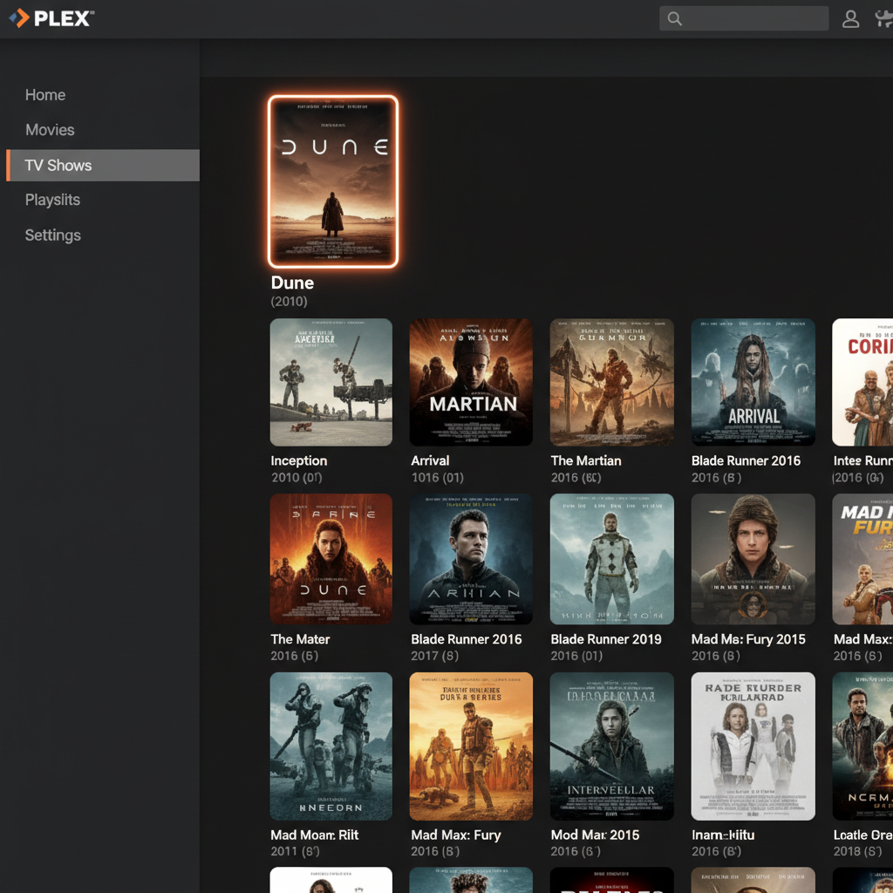
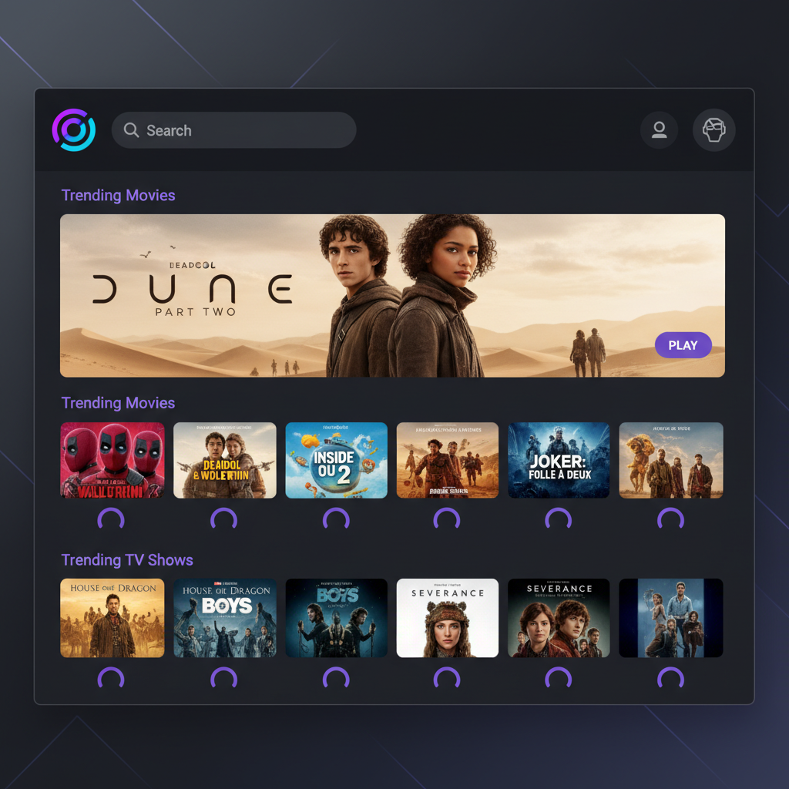
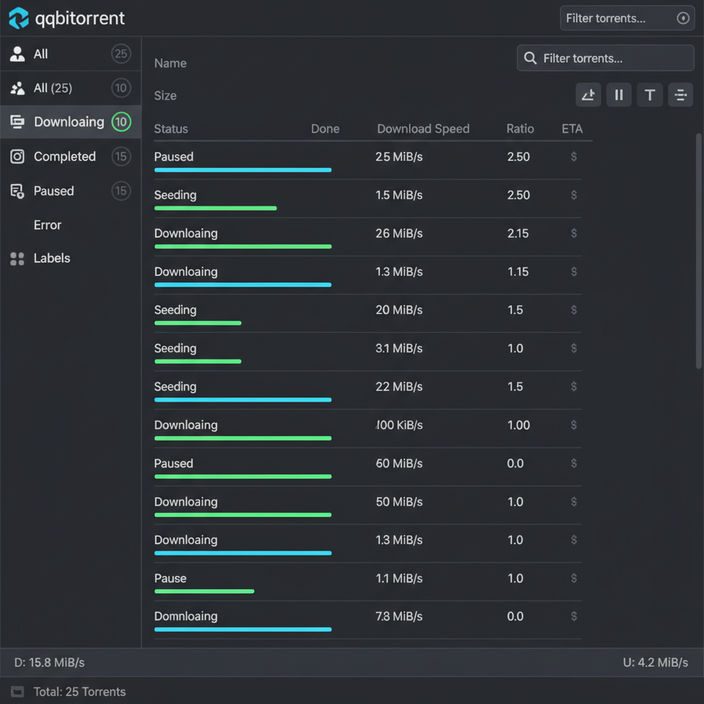
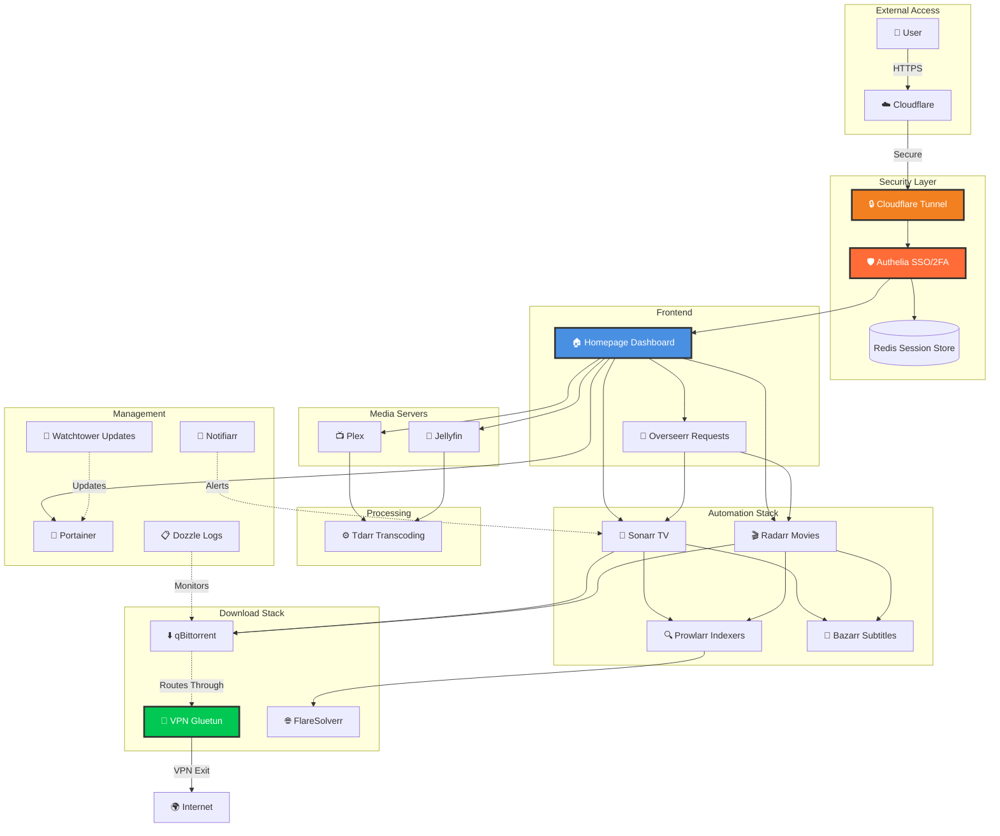

<!-- markdownlint-disable MD033 -->
<div align="center">

# 🎬 Ultimate Media Stack
### Enterprise-grade self-hosted media platform with SSO, VPN isolation, and AI copilots.

<!-- markdownlint-disable MD013 -->
<p align="center">
  
  
  
  
  
</p>
<!-- markdownlint-enable MD013 -->

<p align="center">
  <strong>One repo to bootstrap a secure, automated Plex + Jellyfin stack with Cloudflare Zero Trust, Authelia SSO/2FA, VPN-protected downloads, AI onboarding assistants, and a gorgeous dashboard.</strong>
</p>

<p align="center">
  <a href="#-table-of-contents">Explore the README</a> •
  <a href="#-quick-start-paths">Quick Start</a> •
  <a href="docs-site">Docs Site</a> •
  <a href="https://github.com/Morlock52/Media-stack-ga/issues">Issues</a> •
  <a href="https://github.com/Morlock52/Media-stack-ga/discussions">Discussions</a>
</p>

---

</div>

## 🔎 Table of Contents

- [Why Ultimate Media Stack](#-why-ultimate-media-stack)
- [Stack at a Glance](#-stack-at-a-glance)
- [Documentation & Reports](#-documentation--reports-new)
- [AI Assistants](#-ai-assistants-new)
- [Screens & Storyboard](#-screens--storyboard)
- [Feature Highlights](#-feature-highlights)
- [Architecture & Flow](#-architecture--flow)
- [Quick Start Paths](#-quick-start-paths)
- [Requirements & Prep](#-requirements--prep)
- [Installation Journey](#-installation-journey)
- [Cloudflare Tunnel Playbook](#-cloudflare-tunnel-playbook)
- [First-Time Configuration](#-first-time-configuration)
- [Directory Blueprint](#-directory-blueprint)
- [Operations Playbook](#-operations-playbook)
- [Security Hardening](#-security-hardening)
- [Advanced Configuration](#-advanced-configuration)
- [Service Comparison](#-service-comparison)
- [Learn & Support](#-learn--support)
- [Contributing](#-contributing)
- [FAQ](#-faq)
- [License](#-license)
- [Acknowledgments](#-acknowledgments)

## 📚 Documentation & Reports (NEW!)

We maintain rigorous documentation to ensure enterprise-grade reliability.

| Document | Description |
| --- | --- |
| 📊 [**Executive Summary**](docs/EXECUTIVE_SUMMARY.md) | High-level project status, scores, and deployment verdict. |
| ⚡ [**Quick Wins**](docs/QUICK_WINS.md) | Immediate security and performance fixes (Copy-Paste ready). |
| 🧬 [**Stress Test Report**](docs/STRESS_TEST_REPORT.md) | Comprehensive methodology and criteria for system validation. |
| 📘 [**Best Practices**](docs/BEST_PRACTICES_REPORT.md) | Compliance analysis against December 2025 standards. |
| 🧪 [**Functional Results**](docs/FUNCTIONAL_TEST_RESULTS.md) | Verification of all stack components and AI features. |
| 🧹 [**Tech Bloat Removal**](docs/TECH_BLOAT_REMOVAL.md) | Strategy for minimizing dependencies and bundle size. |

> **Note:** Older planning documents have been moved to [`docs/archive/`](docs/archive/) to keep the root clean.

## 💡 Why Ultimate Media Stack?

- 🔐 **Production-grade perimeter** — Cloudflare Tunnel + Authelia + Redis deliver Zero Trust entry with SSO, 2FA, Argon2-hashed secrets, and zero open ports on your router.
- 🧠 **Guided onboarding** — Interactive TUI installers, a docs site, and multiple AI copilots walk newcomers through every decision while staying scriptable for power users.
- 🎬 **Dual streaming engines** — Plex and Jellyfin share the same libraries, with Tdarr pipelines, TRaSH-compatible profiles, and Overseerr requests feeding Sonarr/Radarr automatically.
- ⬇️ **VPN-enforced downloads** — Gluetun encapsulates qBittorrent, FlareSolverr, and indexer traffic with firewall guardrails so nothing leaks onto the public internet.
- 🛠 **DevOps ergonomics** — Docker Compose orchestrates everything with Watchtower updates, Dozzle logs, Portainer GUI, Notifiarr notifications, and health probes surfaced on the dashboard.
- 🌍 **Cross-platform comfort** — Works on Windows, macOS, and Linux, whether you deploy to a NAS, mini PC, homelab cluster, or remote VPS.

## 🧱 Stack at a Glance

| Layer | Components | Highlights |
| --- | --- | --- |

| Access & Security |    | Zero Trust edge, SSO/2FA, centralized session store, Argon2 hashing |
| Media Core |     | Dual media servers, audiobooks/podcasts, hardware-friendly transcoding |
| Automation & Requests |      | Auto-search, quality enforcement, subtitle syncing, user-friendly requests |
| Library Extensions |    | Comics/Manga, Recipe Manager, AI Photo Organization |
| Downloads |    | VPN-only download path, captcha bypass, kill-switch firewall |
| Ops & DX |      | Auto-discovered dashboard, GUI container management, live logs, proactive updates/alerts |

## 🤖 AI Assistants (NEW!)

- 🚀 **Setup Guide** — interactive coach that walks you through prerequisites, secrets, Cloudflare linkage, and media paths.
- 🔍 **Dr. Debug** — diagnoses failing containers, highlights conflicting ports, and proposes command snippets to fix them.
- 📱 **App Expert** — contextual encyclopedia covering every service, surfaced directly from the dashboard.
- 🚢 **Deploy Captain** — helps mirror this stack onto remote servers or friends' homelabs with templated commands.
- 🎤 **Voice Companion** — voice-guided instructions for screen-free setup sessions.
- 🟢 **Status Chips & Health Monitor** — real-time chips show what the AI is doing; the health monitor auto-detects broken containers and suggests remediation.

## 🎛️ Configuration & Management

### 📥 Save & Load Profiles
Never lose a configuration again. The wizard includes a robust **Profile Manager** that lets you:
- **Save** your current stack selection, domain, and storage settings as a named profile (e.g., "Home Server", "Test Lab").
- **Load** any saved profile to instantly restore your wizard state.
- **Export** your configuration to a JSON file for backup or sharing.
- **Import** configurations from other users or backups.

### ➕ Add/Remove Services
The **Stack Selection** step allows for granular control over your media empire:
- **Add Services**: Toggle on any of the supported 20+ applications (Plex, Jellyfin, Sonarr, Radarr, etc.) from the catalog.
- **Remove Services**: Disable any default service you don't need with a single click.
- **Smart Dependencies**: The wizard automatically handles dependencies (e.g., selecting Sonarr adds Prowlarr recommendations).

## 📸 Screens & Storyboard

<div align="center">

<details open>
<summary>🏠 Auto-Discovering Dashboard</summary>



*Homepage instantly lists every running service, synced from `config/homepage/*.yaml`.*

</details>

<details>
<summary>📺 Media Library</summary>



*Track movies, shows, and metadata at a glance across Plex and Jellyfin.*

</details>

<details>
<summary>🎯 Request Workflow</summary>



*Overseerr gives users a friendly way to request content that feeds Sonarr/Radarr automatically.*

</details>

<details>
<summary>⬇️ Download Control</summary>



*qBittorrent stays fully wrapped by Gluetun so every transfer rides the VPN tunnel.*

</details>


<details>
<summary>📚 Interactive Documentation</summary>


*A modern, interactive documentation site with AI-powered guides and search.*

</details>

</div>

## ✨ Feature Highlights

<table>
<tr>
<td width="50%">

#### 🔐 Security First
- Single Sign-On with Authelia
- Time-based OTP 2FA for every user
- Cloudflare Zero Trust tunnel (no port forwarding)
- Automated SSL/TLS + HSTS-ready endpoints
- Argon2 password hashing with salted secrets
- Redis-backed sessions for resilience and scale

</td>
<td width="50%">

#### 🚀 Automation Fabric
- Auto-discovery dashboard powered by Homepage
- Watchtower keeps containers patched nightly
- Prowlarr orchestrates indexers for Sonarr/Radarr
- Tdarr automates transcodes & normalization jobs
- Bazarr fetches subtitles; Notifiarr pushes alerts
- Real-time notifications and health status chips

</td>
</tr>
<tr>
<td width="50%">

#### 🎬 Media Intelligence
- Plex + Jellyfin run side-by-side
- Overseerr funnels user requests into Sonarr/Radarr
- TRaSH-compatible quality and naming profiles
- Optional Tautulli analytics for Plex insights
- Flexible library roots for movies, shows, music, downloads

</td>
<td width="50%">

#### 🛠️ DevOps Ready
- One-click guided setup (gum-based TUI)
- Docker Compose orchestration & scaling
- Dozzle log viewer + Portainer UI
- Cross-platform scripts (Windows/macOS/Linux)
- Environment-based config for secret rotation

</td>
</tr>
<tr>
<td colspan="2">

#### 🤖 AI-Enhanced Operations
- Multi-agent experience orchestrated from the docs site
- Real-time status chips show which agent is active
- Health monitor surfaces failing containers with fixes
- Voice + text experiences for every skill level

</td>
</tr>
</table>

## 🏗️ Architecture & Flow



### 🔄 Lifecycle

```text
┌──────────────────────┐      ┌──────────────────────────────┐
│ User hits *.domain → │────▶│ Cloudflare → Tunnel → Authelia│
└──────────────────────┘      └──────────────────────────────┘
                 ↓ SSO/2FA passes
┌───────────────────────────────────────────────┐
│ Homepage auto-discovers every internal service│
└───────────────────────────────────────────────┘
                 ↓ Requests sync
┌─────────────┬─────────────┬───────────────────────────────┐
│ Overseerr   │ Sonarr/Radarr│ qBittorrent → Gluetun → Tdarr│
└─────────────┴─────────────┴───────────────────────────────┘
                 ↓
┌───────────────────────────────────────────────┐
│ Plex/Jellyfin stream optimized media to users │
└───────────────────────────────────────────────┘
```

## 🚀 Quick Start Paths

| 🎓 Guided (Host Mode) | 🐳 Guided (Docker Mode) | 🧠 Power User |
| --- | --- | --- |
| 1. Install Docker.<br>2. Run setup:<br>`./setup.sh`<br>3. Run dashboard locally:<br>`cd docs-site`<br>`npm install`<br>`npm run dev` | 1. Install Docker.<br>2. Configure `.env` with **absolute paths**.<br>3. Run dashboard in container:<br>`docker compose -f docker-compose.wizard.yml up -d`<br>4. Open `http://localhost:3000`. | 1. Manual config.<br>2. Generate `.env`:<br>`./setup_auto.sh`<br>3. Launch stack:<br>`docker-compose up -d`<br>4. Secrets management via Vault/GitOps. |

> 💡 Both paths converge on the same Docker Compose stack—pick the experience that matches today’s confidence level.

## 🎙️ AI Voice Companion (Newbie Optimized)

> **Status**: Beta | **Privacy**: Data processed via OpenAI (Your Key) | **Fallback**: Text Input Available

For users who don't know "Containers" from "Compose files," the **Voice Companion** acts as a human-friendly onboarding agent. It conducts a short interview to build your stack for you.

### How to Use
1.  **Open the Wizard**: Go to `http://localhost:3000` (or `3002`).
2.  **Click "Start Interview"**: Look for the microphone icon in the "Newbie" path.
3.  **Speak Naturally**:
    *   *"I want to build a Netflix for my family on my old gaming PC."*
    *   *"I need to download anime and I have a Synology NAS."*
4.  **Review & Apply**: The AI will generate a structured plan (Services, Hosting, Storage). Click **Apply Plan** to auto-fill the wizard.

### Example Interaction
| 🗣️ You (Voice or Text) | 🤖 AI Response | ⚙️ Result |
| :--- | :--- | :--- |
| "I have a Synology 920+ and I want to use Plex." | "Excellent choice. Since you're on a Synology, I'll recommend the Docker method with hardware transcoding enabled. Do you need a way to request movies?" | - Sets Platform: `Synology`<br>- Adds: `Plex`, `Tautulli`<br>- Prompts for: `Overseerr` |
| "Yes, and I use private torrent trackers." | "Understood. I'll add Prowlarr for indexer management and qBittorrent for downloads. Be sure to configure your VPN." | - Adds: `Prowlarr`, `qBittorrent`<br>- Adds: `Gluetun` (VPN container) |

**Pro Tip**: If your environment is noisy, use the **manual text input** at the bottom of the voice panel.

## 🥟 Deploy with Bun

Prefer [Bun](https://bun.sh)? You can use it to speed up the setup and run the docs site.

1.  **Install Bun**: `curl -fsSL https://bun.sh/install | bash`
2.  **Run Setup**: The `setup.sh` script automatically detects Bun.
3.  **Run Docs Site**:
    ```bash
    cd docs-site
    bun install
    bun run dev
    ```


## 📋 Requirements & Prep

| Requirement | Description | Free Option |
|------------|-------------|-------------|
| 🐳 **Docker** | Container runtime | ✅ Yes |
| 🐙 **Docker Compose** | Container orchestration | ✅ Yes |
| 🌐 **Domain Name** | Needed for Cloudflare Tunnel & SSL | ✅ Free subdomains available |
| ☁️ **Cloudflare Account** | Zero Trust tunnel & DNS | ✅ Free tier works |
| 💻 **OS** | Windows, macOS, or Linux | ✅ All supported |

Checklist before you begin:
- [ ] Docker Engine installed and running.
- [ ] Domain onboarded to Cloudflare (nameservers moved or partial CNAME setup).
- [ ] VPN provider credentials compatible with Gluetun.
- [ ] Ports 80/443 free locally (Cloudflare tunnel handles ingress).

<details>
<summary>📦 <strong>Install Docker & Compose by Platform</strong></summary>

### 🐧 Linux
```bash
# Ubuntu/Debian
sudo apt update && sudo apt install docker.io docker-compose -y
sudo systemctl enable --now docker
sudo usermod -aG docker $USER

# Arch Linux
sudo pacman -S docker docker-compose
sudo systemctl enable --now docker
```

### 🍎 macOS
```bash
# Install Docker Desktop
brew install --cask docker

# Or use Colima (lightweight alternative)
brew install colima docker docker-compose
colima start
```

### 🪟 Windows
```powershell
# Docker Desktop with WSL2 backend (recommended)
winget install Docker.DockerDesktop

# Or Chocolately
choco install docker-desktop
```

</details>

## 🛠️ Installation Journey

### 1️⃣ Clone the Repository
```bash
git clone https://github.com/Morlock52/Media-stack-ga.git
cd Media-stack-ga
```

### 2️⃣ Prime Your Environment
- Copy `.env.example` to `.env` if you want manual control.
- Gather VPN credentials, domain, timezone, and master passwords.
- Optional: stage media directories under `/srv/mediastack` (Linux) or `C:\mediastack` (Windows).

### 3️⃣ Run the Setup TUI
```bash
chmod +x setup.sh
./setup.sh
```
What it does:
- Installs `gum` for the UI.
- Prompts for domain, Cloudflare mode, VPN creds, and secrets.
- Generates Authelia user hashes, directory structure, and permissions.
- Optionally pulls & boots Docker services.

### 4️⃣ Launch (or Relaunch) the Stack
```bash
docker-compose up -d
```
Monitor startup:
```bash
# Tail everything
docker-compose logs -f
# Or watch a specific service
docker-compose logs -f plex
```

## ☁️ Cloudflare Tunnel Playbook

The setup script lets you pick **Automatic** or **Manual** tunnel creation. Here’s what each path expects:

### ✅ Option 1 — Automatic (recommended)
1. Create a Cloudflare API Token with:
   - Zone → Zone (Read)
   - Zone → DNS (Edit)
   - Account → Cloudflare Tunnel (Edit)
2. Provide the token inside the TUI when prompted.
3. Script creates the tunnel, wildcard DNS (`*.yourdomain.com`), and stores credentials in `config/cloudflared/`.
4. Finish by defining Public Hostnames in the Zero Trust dashboard (map subdomains to internal services like `http://plex:32400`).

### ✍️ Option 2 — Manual
1. In [Cloudflare Zero Trust](https://one.dash.cloudflare.com/), create a tunnel manually and copy the token.
2. When the TUI asks, choose **Manual** and paste the token.
3. Create a wildcard CNAME pointing to `<tunnel-id>.cfargotunnel.com`.
4. Configure Public Hostnames to route traffic (Homepage, Authelia, Plex, Jellyfin, etc.).

## 🔐 First-Time Configuration

### 👤 Authelia Bootstrap Credentials

```text
Username: morlock
Password: Morlock52$ (or your master password)
```
> ⚠️ Change the password immediately.

Generate a new hash:
```bash
docker run --rm authelia/authelia:latest \
  authelia crypto hash generate argon2 \
  --password 'YourNewSecurePassword123!'
```
Update `config/authelia/users_database.yml` with the new hash.

### 📋 Service Configuration Checklist

<details>
<summary>📺 <strong>Plex</strong></summary>

1. Visit `https://plex.yourdomain.com`.
2. Sign in with your Plex account.
3. Add libraries (e.g., `/media/movies`, `/media/tvshows`, `/media/music`).
4. Settings → Network:
   - Custom server access URLs: `https://plex.yourdomain.com`
   - Secure connections: Preferred.

</details>

<details>
<summary>🎥 <strong>Jellyfin</strong></summary>

1. Visit `https://jellyfin.yourdomain.com` and complete the wizard.
2. Add libraries with the same mount paths as Plex.
3. Leave base URL empty (tunnel handles HTTPS).

</details>

<details>
<summary>🔍 <strong>Prowlarr</strong></summary>

1. Visit `https://prowlarr.yourdomain.com`.
2. Add indexers and FlareSolverr (`http://flaresolverr:8191`).
3. Connect Sonarr/Radarr via Settings → Apps (host `http://prowlarr:9696`).

</details>

<details>
<summary>📡 <strong>Sonarr & Radarr</strong></summary>

- Root folders: `/media/tvshows` (Sonarr) & `/media/movies` (Radarr).
- Download client: qBittorrent (`qbittorrent:8080`, user `admin`, change password!).
- Import TRaSH quality profiles for best-possible automation.

</details>

<details>
<summary>⬇️ <strong>qBittorrent</strong></summary>

1. Default credentials: `admin` / `adminadmin` (change immediately).
2. Verify VPN binding (Settings → Advanced → Network Interface should show the Gluetun adapter).
3. Save path: `/media/downloads`, incomplete path `/media/downloads/incomplete`.

</details>

<details>
<summary>🎯 <strong>Overseerr</strong></summary>

1. Visit `https://request.yourdomain.com`.
2. Sign in with Plex, add Plex server, Sonarr (`http://sonarr:8989`), and Radarr (`http://radarr:7878`).
3. Configure default quality profiles and notification targets.

</details>

<details>
<summary>⚙️ <strong>Tdarr</strong></summary>

1. Visit `https://tdarr.yourdomain.com`.
2. Add libraries pointing at `/media/movies` and `/media/tvshows`.
3. Enable or scale Tdarr nodes for faster transcoding.

</details>

## 📂 Directory Blueprint

```text
/srv/mediastack/
│
├── config/                  # Application configurations
│   ├── authelia/
│   ├── homepage/
│   ├── plex/
│   ├── jellyfin/
│   ├── sonarr/
│   ├── radarr/
│   ├── prowlarr/
│   ├── qbittorrent/
│   ├── overseerr/
│   ├── tdarr/
│   └── ...
├── media/                   # Media libraries + downloads
│   ├── movies/
│   ├── tvshows/
│   ├── music/
│   └── downloads/
├── scripts/
├── docker-compose.yml
├── .env
└── setup.sh / setup.ps1 / setup_auto.sh
```

## 🧭 Operations Playbook

### 📊 Monitoring
- **Dozzle**: `https://dozzle.yourdomain.com` for live logs.
- **Portainer**: `https://portainer.yourdomain.com` for container lifecycle.
- CLI essentials:
  ```bash
  docker-compose ps
  docker-compose logs --tail=100 sonarr
  ```

### 🔄 Updates
- **Automatic**: Watchtower pulls images nightly (default: 04:00).
- **Manual refresh**:
  ```bash
  docker-compose pull
  docker-compose up -d
  docker image prune -a
  ```

### 💾 Backup Strategy

| Priority | Path | Why |
| --- | --- | --- |
| 🔴 Critical | `config/authelia/` | Users, secrets, policies |
| 🔴 Critical | `.env` | Environment secrets + tokens |
| 🟡 Important | `config/*/` | App states and metadata |
| 🟢 Optional | `media/` | Replaceable if sourced elsewhere |

Sample script:
```bash
#!/bin/bash
DATE=$(date +%Y%m%d)
BACKUP_DIR="/path/to/backups"

tar -czf $BACKUP_DIR/config-$DATE.tar.gz /srv/mediastack/config
cp /srv/mediastack/.env $BACKUP_DIR/env-$DATE.backup
find $BACKUP_DIR -name "*.tar.gz" -mtime +7 -delete
```

### 🧰 Troubleshooting Cards

<details>
<summary>❌ Containers won’t start</summary>

```bash
docker-compose logs -f <service>
```
- Look for port conflicts via `docker ps -a`.
- Fix permissions: `sudo chown -R $USER:$USER /srv/mediastack`.
- Missing `.env`? Copy from template and re-run setup.

</details>

<details>
<summary>🌐 Can’t access services through Cloudflare</summary>

- Check tunnel logs: `docker-compose logs cloudflared`.
- Validate tunnel token + credentials file.
- Ensure Public Hostnames map to internal URLs (`http://plex:32400`).
- DNS record should be orange-cloud proximal.

</details>

<details>
<summary>🔒 Authelia login issues</summary>

- Inspect logs: `docker-compose logs authelia`.
- Verify `users_database.yml` indentation.
- Regenerate password hash if in doubt.
- Confirm Redis connectivity via `docker-compose logs redis`.

</details>

<details>
<summary>⬇️ Downloads not using VPN</summary>

- View Gluetun logs for connection status.
- From qBittorrent container: `docker exec qbittorrent curl ifconfig.me` (should not reveal your real IP).
- Update VPN credentials or servers in `.env` and restart Gluetun.

</details>

## 🛡 Security Hardening

### ✅ Checklist
- [ ] Change every default password (Authelia, qBittorrent, Overseerr, etc.).
- [ ] Enable 2FA in Authelia for all users.
- [ ] Verify qBittorrent only binds to Gluetun interface.
- [ ] Enable Cloudflare WAF & Access policies per subdomain.
- [ ] Backup Authelia secrets and `.env` securely.
- [ ] Keep Docker host patched and limited to trusted users.

### 🧰 Advanced Controls

**Authelia session policy** (`config/authelia/configuration.yml`):
```yaml
session:
  expiration: 1h
  inactivity: 15m
  remember_me: 1M
```

**Cloudflare Access ideas:** restrict by country, hardware key, or IP list on critical apps (Authelia, Overseerr, Portainer).

**VPN kill switch (already wired):**
```yaml
gluetun:
  cap_add:
    - NET_ADMIN
  environment:
    - FIREWALL_OUTBOUND_SUBNETS=192.168.1.0/24
```

## 🔧 Advanced Configuration

### 🎨 Homepage Customization
```yaml
# config/homepage/services.yaml
- Media:
    - Custom Service:
        icon: custom-icon.png
        href: https://custom.yourdomain.com
        description: My custom service
        widget:
          type: customapi
          url: http://custom-service:1234
```

### 🔔 Notifications
1. Grab a Notifiarr API key.
2. Add `NOTIFIARR_API_KEY=...` to `.env`.
3. Configure each *arr app → Connect → Notifiarr (or Discord/Telegram) and select desired events.

### ⚙️ Performance Tuning
- **Plex hardware transcoding** (Intel QuickSync / NVIDIA):
  ```yaml
  plex:
    devices:
      - /dev/dri:/dev/dri
    # or
    runtime: nvidia
    environment:
      - NVIDIA_VISIBLE_DEVICES=all
  ```
- **Tdarr scale-out**:
  ```bash
  docker-compose up -d --scale tdarr-node=3
  ```
- **Storage savings**: Use Tdarr + H.265 profiles to reclaim 40–60% space.

## 📊 Service Comparison

| Feature | Plex | Jellyfin |
|---------|------|----------|
| Cost | Free + Plex Pass | 100% Free & Open Source |
| Mobile Apps | ✅ Excellent | ✅ Improving fast |
| Hardware Transcoding | ✅ (Plex Pass) | ✅ Free |
| Privacy | Cloud-connected | Fully offline |
| Plugins | Limited | Extensive community |
| Recommendation | Best UX & ecosystem | Best privacy/control |

💡 This stack ships both—try each and decide.

## 📚 Learn & Support

**Documentation**
- [Homepage](https://gethomepage.dev/)
- [Authelia](https://www.authelia.com/docs/)
- [Sonarr Wiki](https://wiki.servarr.com/sonarr)
- [Radarr Wiki](https://wiki.servarr.com/radarr)
- [TRaSH Guides](https://trash-guides.info/)

**Video Tutorials**
- [TRaSH Guides YouTube](https://www.youtube.com/c/TRaSHGuides)
- [DB Tech](https://www.youtube.com/c/DBTechYT)
- [Techno Tim](https://www.youtube.com/c/TechnoTimLive)

**Communities**
- [r/selfhosted](https://reddit.com/r/selfhosted)
- [r/PleX](https://reddit.com/r/PleX)
- [Jellyfin Forum](https://forum.jellyfin.org/)
- [Servarr Discord](https://discord.gg/YQTQPZ6)

## 🤝 Contributing

1. Fork the repository.
2. Create a feature branch: `git checkout -b feature/amazing-feature`.
3. Commit changes: `git commit -m "Add amazing feature"`.
4. Push and open a Pull Request.

We love bug reports, feature ideas, documentation tweaks, and dashboards screenshots!

## ❓ FAQ

<details>
<summary><strong>Do I need a VPN provider?</strong></summary>

Yes—Gluetun expects credentials from providers like Mullvad, ProtonVPN, IVPN, etc. It supports 40+ vendors out of the box.

</details>

<details>
<summary><strong>Can I run this without Cloudflare?</strong></summary>

Absolutely. Alternatives include Tailscale, WireGuard, Twingate, or Nginx Proxy Manager. Remove the `cloudflared` service and expose via your preferred reverse proxy.

</details>

<details>
<summary><strong>How much storage do I need?</strong></summary>

- Starter: 2 TB (~500 movies + 50 shows)
- Medium: 8 TB (~2,000 movies + 200 shows)
- Large: 16 TB+ for serious collectors

Use Tdarr (H.265) to save 40–60% space.

</details>

<details>
<summary><strong>What hardware do you recommend?</strong></summary>

- Minimum: 4 cores / 8 GB RAM / SSD for configs.
- Recommended: 6+ cores or GPU for transcoding, 16 GB RAM, SSD + HDD mix.
- Raspberry Pi 4 can run basics but transcoding will be slow.

</details>

<details>
<summary><strong>Is this legal?</strong></summary>

The software is open-source and legal. Use it to manage content you own—piracy is your responsibility and not endorsed.

</details>

## 📜 License

This project is licensed under the MIT License — see [LICENSE](LICENSE) for details.

## 🙏 Acknowledgments

Powered by amazing open-source work:
- [Homepage](https://github.com/gethomepage/homepage)
- [Authelia](https://github.com/authelia/authelia)
- [Sonarr](https://github.com/Sonarr/Sonarr) / [Radarr](https://github.com/Radarr/Radarr)
- [Jellyfin](https://github.com/jellyfin/jellyfin)
- [Gluetun](https://github.com/qdm12/gluetun)
- [TRaSH Guides](https://trash-guides.info/)
- Every other maintainer who makes this stack possible ❤️


## 🏗️ System Architecture

Understanding how the pieces fit together is key to managing this stack.

```mermaid
graph TD
    User[User / Internet] -->|HTTPS| CF[Cloudflare Tunnel]
    CF -->|Ingress Rules| Authelia[Authelia (SSO)]
    Authelia -->|Authorized| Traefik[Traefik / Reverse Proxy]
    
    subgraph "Media Stack"
        Traefik --> Plex
        Traefik --> Jellyfin
        Traefik --> Sonarr
        Traefik --> Radarr
        Traefik --> Prowlarr
    end
    
    subgraph "Download & VPN"
        Sonarr -->|Add Torrent| qBit[qBittorrent]
        Radarr -->|Add Torrent| qBit
        qBit -->|Traffic| Gluetun[Gluetun VPN]
        Gluetun -->|Encrypted| Internet
    end
    
    subgraph "Data"
        Plex --> Media[/Media Library/]
        Sonarr --> Media
        qBit --> Downloads[/Downloads/]
    end
```

### Key Flows
1.  **Authentication**: All external access is routed through Cloudflare Tunnel, which enforces Authelia SSO. You must log in to access any service.
2.  **Downloads**: Sonarr/Radarr send `.torrent` files to qBittorrent.
3.  **Privacy**: qBittorrent is networked *through* Gluetun. If the VPN drops, qBittorrent loses connectivity (Kill Switch).

---

## ❓ Troubleshooting

| Symptom | Possible Cause | Fix |
| :--- | :--- | :--- |
| **"Bad Gateway" (502)** | Service is down or starting up. | Run `docker compose ps` to check status. Wait 30s if just started. |
| **"Authelia - 401 Unauthorized"** | Session expired or invalid config. | Clear cookies. Check `docker compose logs authelia`. |
| **qBittorrent UI unreachable** | VPN (Gluetun) failed to connect. | Check `docker compose logs gluetun`. Verify VPN credentials. |
| **Sonarr can't see files** | Volume mapping mismatch. | Ensure `/data` paths match in `docker-compose.yml`. |
| **AI Assistant Offline** | OpenAI Key missing. | Add `OPENAI_API_KEY` to `.env` or Settings. |

---

## 📚 Further Reading

### Official Documentation
- [Servarr Wiki](https://wiki.servarr.com/) (Sonarr, Radarr, Prowlarr docs)
- [Authelia Documentation](https://www.authelia.com/)
- [Docker Compose](https://docs.docker.com/compose/)

### Community Guides
- **[TRaSH Guides](https://trash-guides.info/)**: The "Bible" for configuring Sonarr/Radarr quality profiles and path mapping. **Highly Recommended.**
- [LinuxServer.io](https://www.linuxserver.io/): The team behind most of the Docker images used here.

### Advanced Topics
- [Recyclarr](https://recyclarr.dev/): Automate TRaSH guides.
- [Plex Meta Manager](https://metamanager.wiki/): Automate Plex collections and overlays.

---

<div align="center">

### ⭐️ Star the repo if this saved you time!

**Questions? Issues? Ideas?** → [Open an issue](https://github.com/yourusername/media-stack/issues) or [start a discussion](https://github.com/yourusername/media-stack/discussions)

[⬆ Back to Top](#-ultimate-media-stack)

</div>
