<!-- markdownlint-disable MD033 MD041 MD001 MD036 -->
<div align="center">


# 🎬 Ultimate Media Stack — GA

**Secure self‑hosted media platform with SSO/MFA, VPN‑isolated downloads, and a Matrix HUD wizard + docs experience**

<p align="center">
  
  
  
  
  
  
</p>

<p align="center">
  <strong>Bootstrap a secure, automated Plex + Jellyfin stack with Cloudflare Zero Trust, Authelia SSO/2FA, VPN‑protected downloads (Gluetun), and a cyber‑matrix command center UI.</strong>
</p>

<p align="center">
  <a href="#quick-start">Quick Start</a> •
  <a href="#architecture">Architecture</a> •
  <a href="#security-model">Security Model</a> •
  <a href="docs-site">Docs Site</a> •
  <a href="https://github.com/Morlock52/Media-stack-ga/issues">Issues</a> •
  <a href="https://github.com/Morlock52/Media-stack-ga/discussions">Discussions</a>
</p>

</div>

<p align="center">
  
</p>

<p align="center">
  <em>Current Matrix HUD screenshots are generated via Playwright. Rebuild them with:</em>
</p>

```bash
cd docs-site && UI_REVIEW=1 npx playwright test tests/ui-review.screenshots.spec.ts --workers=1
```

```bash
python docs/scripts/render_diagrams.py
python docs/scripts/render_marketing_assets.py
```

> **Last updated:** December 21, 2025

## ✨ Screenshots (Matrix HUD)

<table align="center">
  <tr>
    <td align="center">
      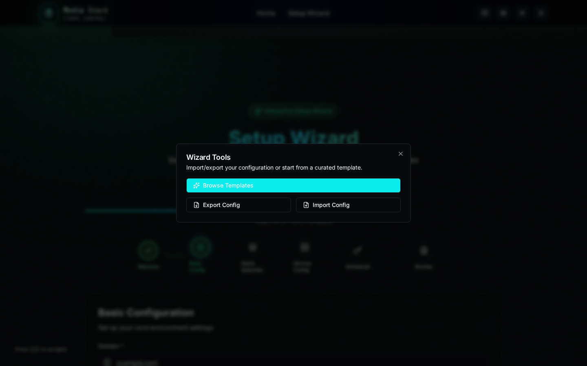
      <br /><sub><b>Tools</b> — templates, import/export</sub>
    </td>
    <td align="center">
      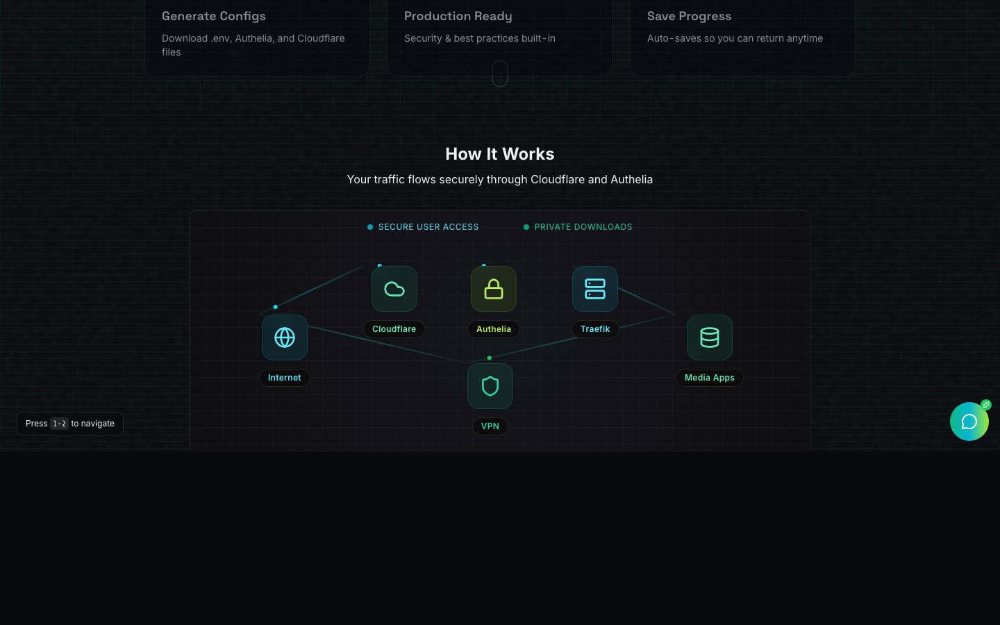
      <br /><sub><b>Service Config</b> — storage planner + per-app settings</sub>
    </td>
  </tr>
  <tr>
    <td align="center">
      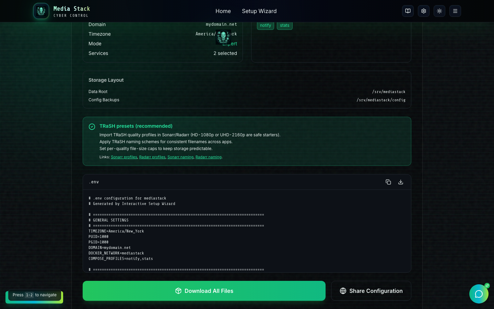
      <br /><sub><b>Review</b> — download configs, share, deploy</sub>
    </td>
    <td align="center">
      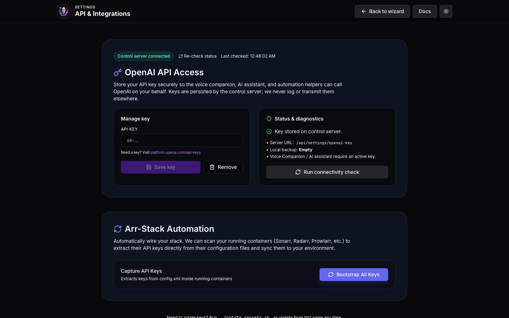
      <br /><sub><b>Settings</b> — API key + Arr automation</sub>
    </td>
  </tr>
  <tr>
    <td align="center">
      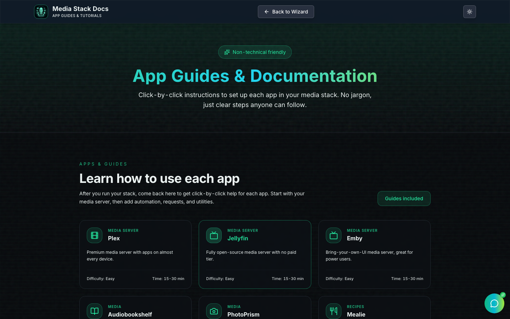
      <br /><sub><b>Docs</b> — click-by-click guides</sub>
    </td>
    <td align="center">
      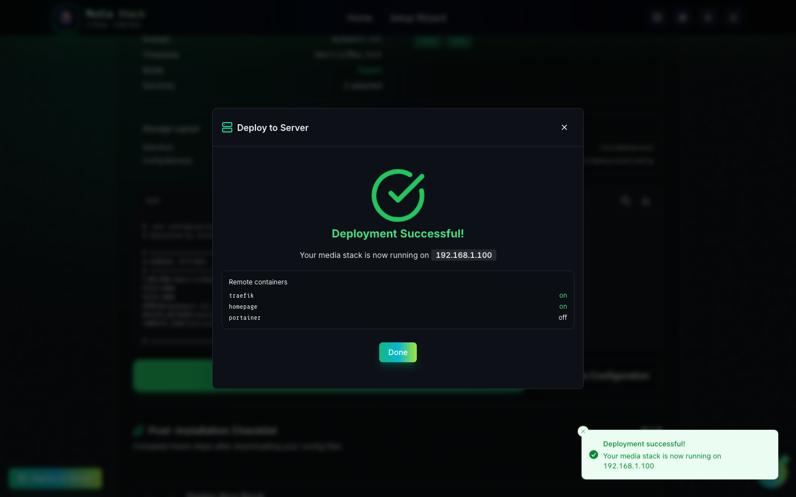
      <br /><sub><b>Remote Deploy</b> — SSH-based deploy flow</sub>
    </td>
  </tr>
</table>

## 🔎 Table of contents

- [**Start Here — Pick Your Setup Path**](docs/START_HERE.md) ⬅️ New? Start here!
- [Screenshots](#-screenshots-current)
- [Quick Start](#-quick-start)
- [Remote Deploy (SSH)](#-remote-deploy-ssh)
- [Access after remote deploy](#-access-after-remote-deploy)
- [Highlights](#-highlights)
- [Stack at a glance](#-stack-at-a-glance)
- [Agentic System](#-agentic-system)
- [Interactive Documentation](#-interactive-documentation)
- [Architecture](#-architecture)
- [Security model](#-security-model)
- [Storage planning](#-storage-planning)
- [Install & run](#-install--run)
- [Tests & stress](#-tests--stress)
- [Operations](#-operations)
- [References](#-references)

## 🚀 Quick start

### 1) Clone

```bash
git clone https://github.com/Morlock52/Media-stack-ga.git
cd Media-stack-ga
```

### 2) Configure env

```bash
cp .env.example .env
# then edit .env with your paths + secrets
```

### 3) Run the setup wizard

```bash
chmod +x setup.sh
./setup.sh
```

### 4) Start the stack

```bash
docker compose up -d
```

---

## 🛰 Remote deploy (SSH)

Remote deploy lets the wizard upload your generated `docker-compose.yml` + `.env` to a remote host over SSH and run `docker compose up -d` for you.

**Prereqs**

- The **control server** is reachable from your browser (Docker wizard mode proxies `/api`; static hosting requires `VITE_CONTROL_SERVER_URL`).
- The **remote server** has Docker + Docker Compose installed and SSH access is open.
- **Password auth** needs `sshpass` installed in the control server environment.

**Step-by-step**

1. Run the wizard and reach **Review & Generate**.
2. Click **Deploy to Server**.
3. Click **Test Connection** (validates SSH, Docker daemon, and Compose).
4. Fill in host/port/user, choose password or key auth, and confirm the deploy path.
5. (Optional) Leave **Auto‑remove conflicting containers** enabled to auto-fix container name conflicts (remove the old container and retry once).
6. (Optional) Leave **Auto-disable VPN/torrent profiles if `/dev/net/tun` is missing** enabled so the rest of the stack can still deploy on hosts without TUN support.
7. Click **Deploy** and follow the live step list.

**What to expect**

- If you click **Deploy** twice, the control server rejects the duplicate request with **HTTP 409** (“deployment already in progress”).
- After SSH connects, the deploy collects a best-effort **remote container snapshot** (name + on/off) and shows it in the UI.

**Where to check logs**

- UI shows per-step status and error details.
- Control server logs: `docker compose logs -f control-server` (or `wizard-api` in wizard mode).
- Remote host logs: `ssh <host> 'cd <deployPath> && docker compose logs -f'`

<p align="center">
  
</p>

---

## 🌐 Access after remote deploy

The deploy does **not** create DNS records or Cloudflare routes. You still need a way to reach your services:

### Option A — Domain + Cloudflare Tunnel (recommended)

1. Set `DOMAIN=example.com` and configure the Cloudflare tunnel token/command in `.env`.
2. Add DNS records or Cloudflare tunnel routes for the subdomains you want.
3. Access apps at `https://<service>.${DOMAIN}` (e.g., `https://plex.example.com`, `https://sonarr.example.com`).
4. Homepage (dashboard) is available at your root host (e.g., `https://example.com`).

### Option B — Local/LAN access (no domain)

1. Open the dashboard at `http://<server-ip>` (Traefik routes the “catch‑all” host to Homepage).
2. For direct subdomain access, add host entries on your machine:

```
<server-ip> plex.local
<server-ip> sonarr.local
<server-ip> radarr.local
```

3. Set `DOMAIN=local` to match the hostnames.

---

## ✅ Highlights

- **Interactive Setup Wizard**: Configure your entire media stack through a step-by-step Matrix HUD flow.
- **Intelligent Documentation**: Automatically generated guides tailored to your specific service selection.
- **Premium UI & Animations**: Matrix glass panels, scanlines, and exportable diagrams.
- **Production-Ready Output**: Generates optimized `.env` and `docker-compose.yml` configurations.

<details>
<summary><strong>More UI screenshots</strong></summary>

<p align="center">
  
</p>

<p align="center">
  
</p>

</details>

## 🤖 Agentic System

Media Stack GA features a powerful Agentic System that allows you to manage your stack through natural language and automated tools:

- **AI-Powered Operations**: Inspect container health, analyze logs, and run common stack commands (when the control server has Docker access).
- **Config Validation**: Quick checks for `.env`, YAML, and JSON config issues before you deploy.
- **Smart Configuration**: Get AI-driven recommendations for environment variables and service settings.
- **Voice Companion**: Control and configure your stack using voice commands through the integrated Voice Companion.
- **Arr-Stack Bootstrapping**: Automatically extract and sync API keys from running Sonarr, Radarr, Prowlarr, and other services.

### Remote deploy + voice quality

- **Remote Deploy** uses the control server (`/api/remote-deploy/*`) and works automatically when the UI is running behind a proxy that forwards `/api` (Docker Wizard mode does this). For static-hosted UIs, set `VITE_CONTROL_SERVER_URL` (or use Settings → “Control Server Connection”).
- If the control server is started with `CONTROL_SERVER_TOKEN`, also set `VITE_CONTROL_SERVER_TOKEN` (or enter the token in Settings) so the UI can authenticate.
- For more natural voice output, you can optionally enable ElevenLabs TTS via `ELEVENLABS_API_KEY` + `ELEVENLABS_VOICE_ID` and set `TTS_PROVIDER=elevenlabs` (or configure it in Settings).

<p align="center">
  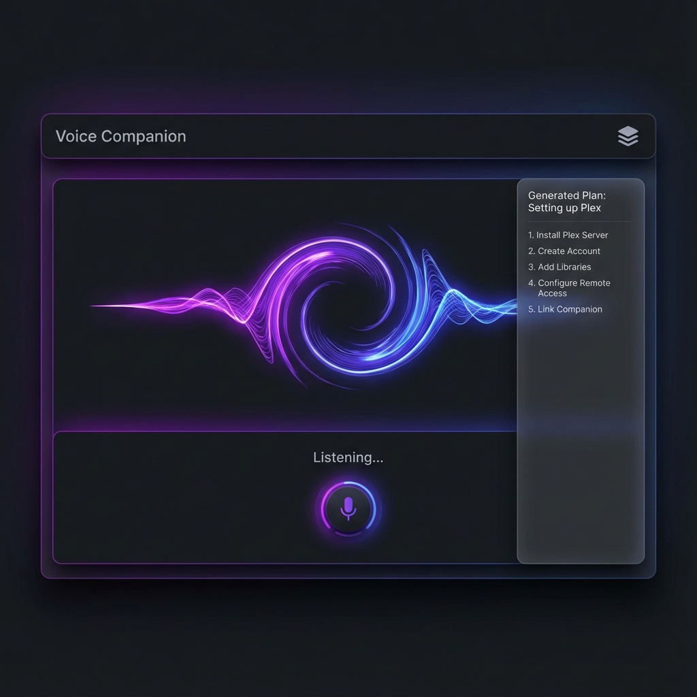
</p>

<p align="center">
  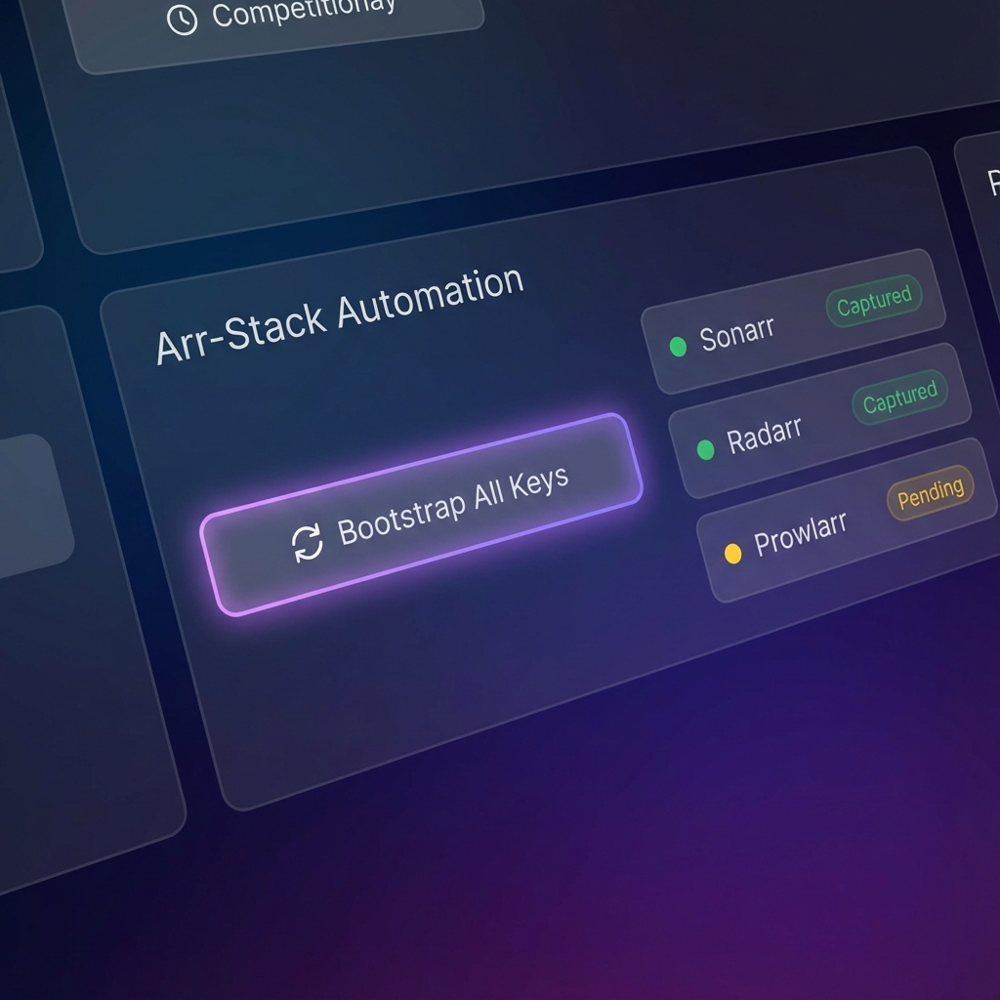
</p>

### Using the AI Assistant

You can interact with the AI Assistant to perform complex tasks:

- _"Check the logs for my download client"_
- _"Validate my updated .env file"_
- _"Bootstrap my arr stack API keys"_
- _"Why is Plex/Jellyfin not reachable behind Authelia?"_

<p align="center">
  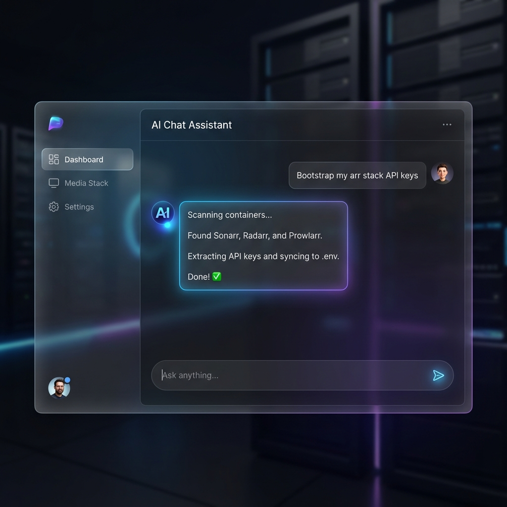
</p>

## 📖 Interactive Documentation

Media Stack includes a comprehensive documentation system that goes beyond static files. The documentation is interactive and adapts to your needs.

<p align="center">
  
</p>

---

## 🧱 Stack at a glance

| Layer             | What it does                                | Key services                                |
| ----------------- | ------------------------------------------- | ------------------------------------------- |
| Edge / Zero‑Trust | Publishes apps without opening router ports | Cloudflare Tunnel (`cloudflared`)           |
| Identity          | Single sign‑on + MFA in front of routes     | Authelia + Redis                            |
| UI / Requests     | Dashboard + content requests                | Homepage + Overseerr                        |
| Media servers     | Streaming to TVs / phones                   | Plex + Jellyfin                             |
| Automation        | Finds/organizes content                     | Sonarr + Radarr + Prowlarr + Bazarr         |
| Downloads         | VPN‑isolated downloads + challenge handling | Gluetun + qBittorrent + FlareSolverr        |
| Ops               | Visibility + updates + notifications        | Portainer + Dozzle + Watchtower + Notifiarr |

> Tip: keep the table short; the long explanations live in the architecture + security sections.

---

## 🏗 Architecture

### PNG diagram (for wikis/PDFs)

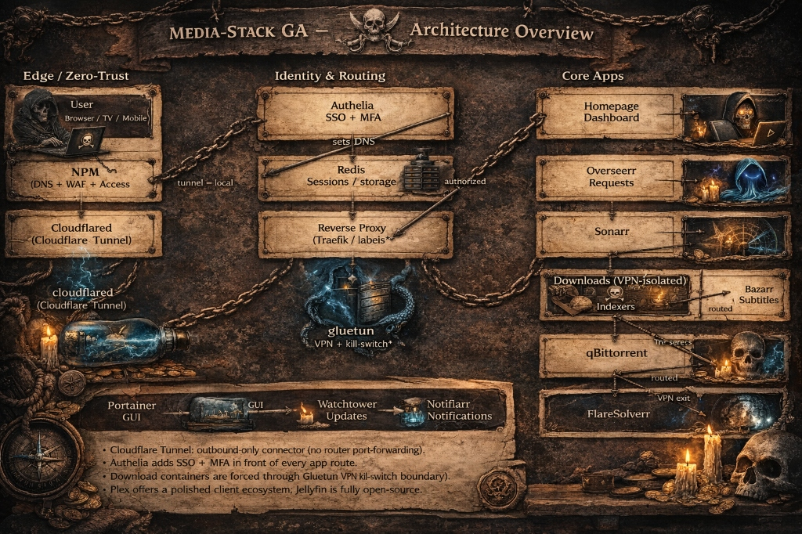

### Mermaid diagram (renders natively on GitHub)

<details>
<summary><strong>Show Mermaid source</strong></summary>

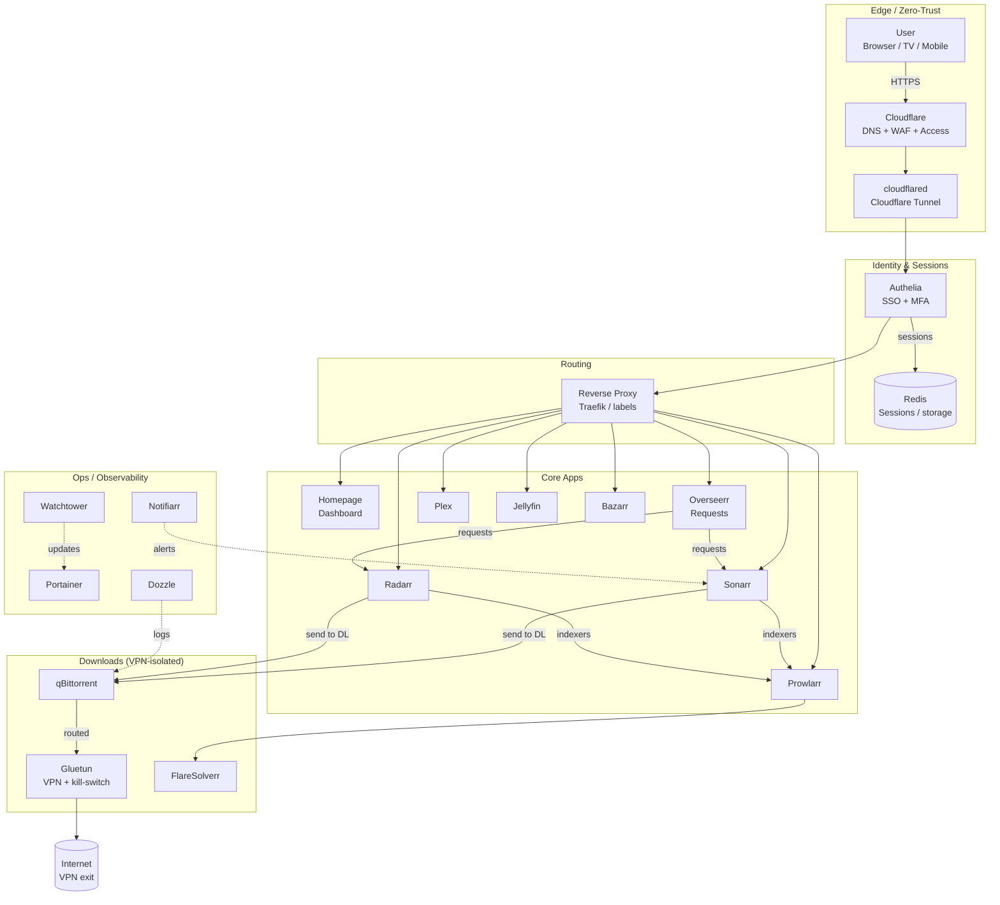

</details>

---

## 🛡 Security model

### Security controls map (PNG)

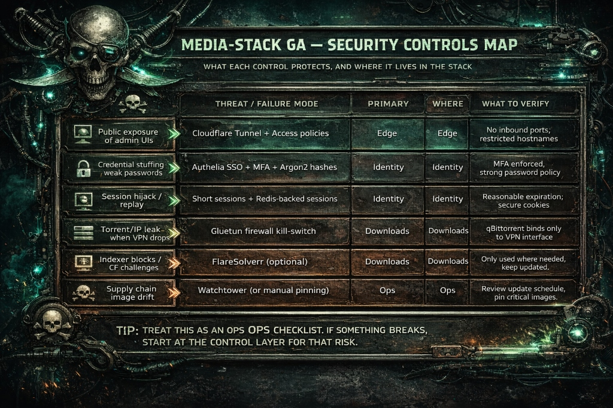

### Security diagram (Mermaid)

<details>
<summary><strong>Show Mermaid security diagram</strong></summary>

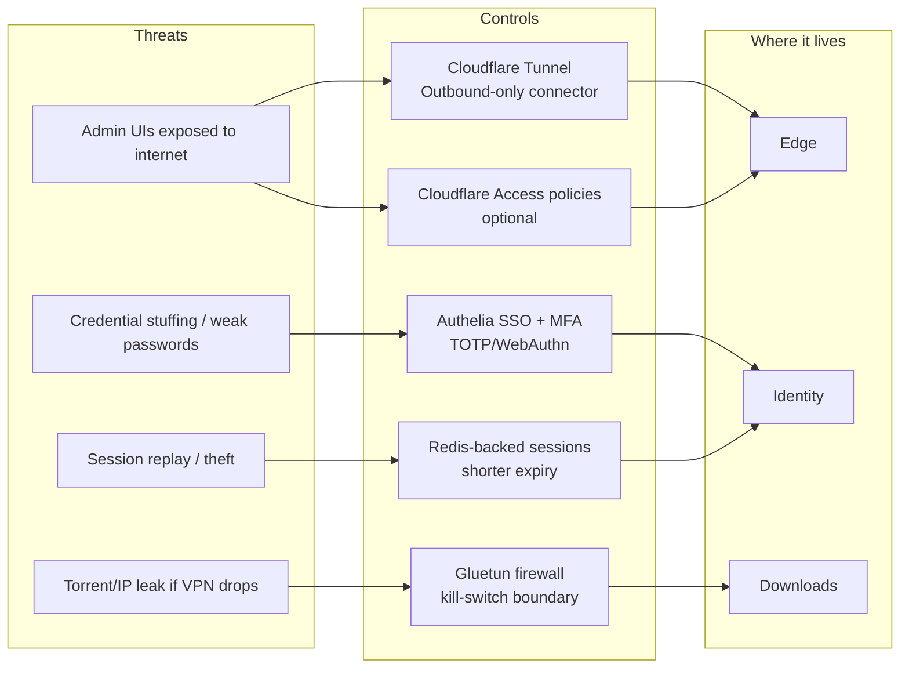

</details>

### What to verify (quick checklist)

- **No inbound ports**: your router should not need 80/443 forwarded if you rely on Tunnel.
- **MFA enforced**: Authelia access policy should require 2FA for sensitive apps (Portainer, download client, etc.).
- **VPN binding**: qBittorrent should bind to the VPN network/interface so it cannot reach the internet without Gluetun.
- **Secrets**: treat `.env` and Authelia configs as sensitive; back them up safely.

---

## 💾 Storage planning

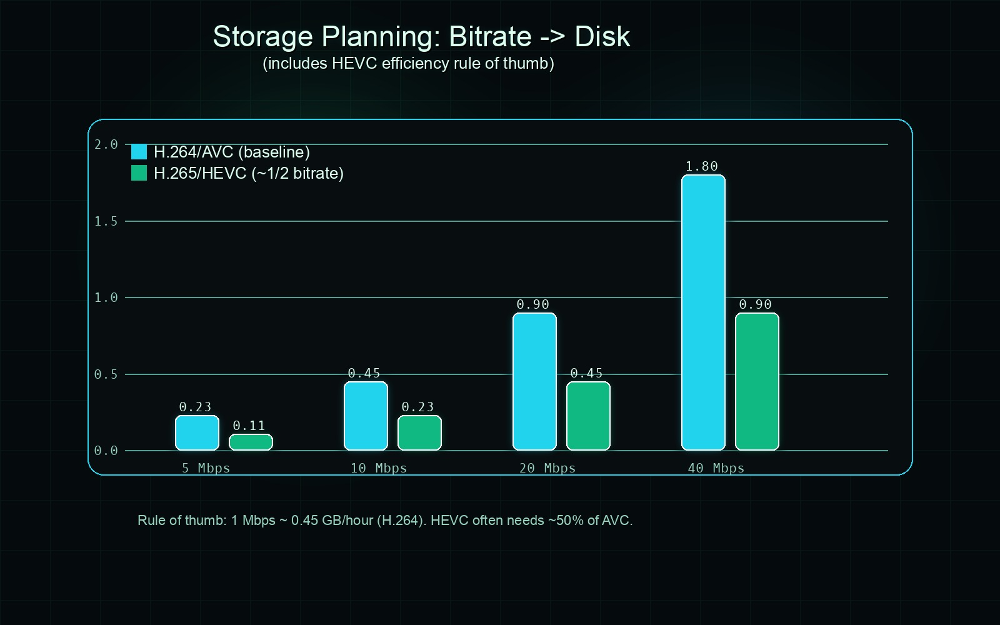

### How to use the chart

1. Pick your typical bitrate bucket (e.g., 10–20 Mbps average).
2. Estimate total watch‑hours of your library.
3. Multiply the chart value for **100 hours** by your hours / 100.

Rule of thumb used:

- **1 Mbps ≈ 0.45 GB/hour** (decimal GB)
- **HEVC/H.265 often targets similar quality at ~½ the bitrate of AVC/H.264** (codec + encoder dependent)

---

## 🧰 Install & run

### Start / stop

```bash
docker compose up -d
docker compose down
```

### Logs

```bash
docker compose logs -f
# or:
docker compose logs -f authelia
```

### Update

```bash
docker compose pull
docker compose up -d
```

---

## ✅ Tests & stress

```bash
npm run lint
npm test
npm run stress
```

---

## 🧭 Operations

### Backup priorities

- **Critical**: `.env`, `config/authelia/`, `config/cloudflared/`
- **Important**: `config/*/` (app DBs / metadata)
- **Optional**: `media/` (depends on your source of truth)

### First places to check when something breaks

- `docker compose ps`
- `docker compose logs -f cloudflared`
- `docker compose logs -f authelia`
- `docker compose logs -f gluetun`

---

## 🔗 References

These links back up the assumptions used in the diagrams & planning chart:

- [Cloudflare Tunnel docs (outbound-only connector model)](https://developers.cloudflare.com/cloudflare-one/networks/connectors/cloudflare-tunnel/)
- [Cloudflare Tunnel firewall requirements](https://developers.cloudflare.com/cloudflare-one/networks/connectors/cloudflare-tunnel/configure-tunnels/tunnel-with-firewall/)
- [Authelia 2FA (WebAuthn)](https://www.authelia.com/configuration/second-factor/webauthn/)
- [Authelia 2FA (TOTP)](https://www.authelia.com/configuration/second-factor/time-based-one-time-password/)
- [Gluetun README (built-in firewall kill-switch)](https://github.com/qdm12/gluetun/blob/master/README.md)
- [Plex hardware-accelerated streaming requires Plex Pass](https://support.plex.tv/articles/115002178853-using-hardware-accelerated-streaming/)
- [Plex server sizing note (RAM)](https://support.plex.tv/articles/200375666-plex-media-server-requirements/)
- [ITU press release (HEVC ~half the bitrate vs AVC claim)](https://www.itu.int/net/pressoffice/press_releases/2013/01.aspx)
