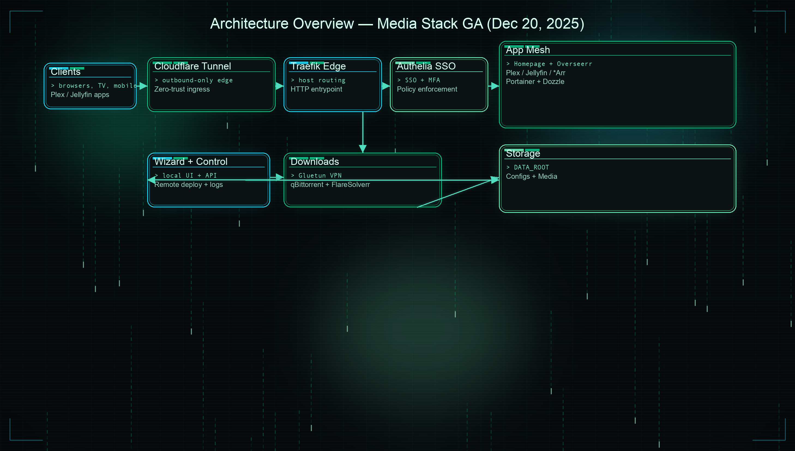
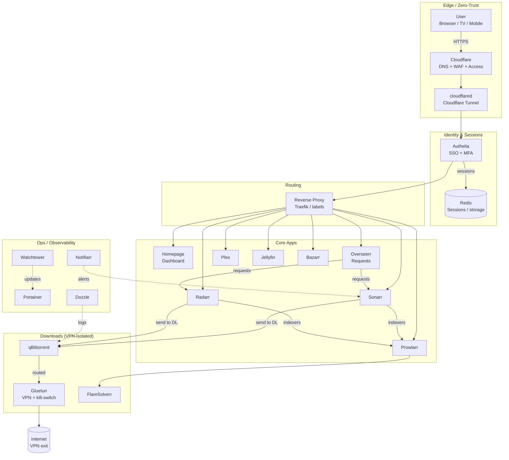
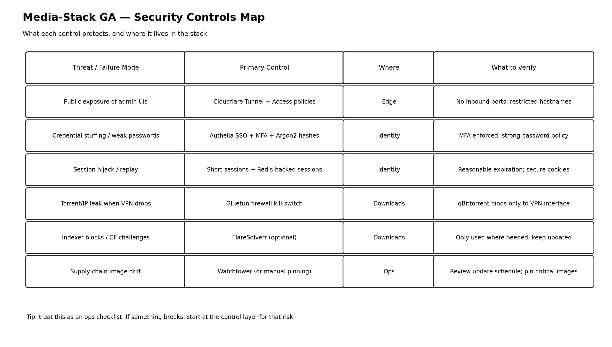
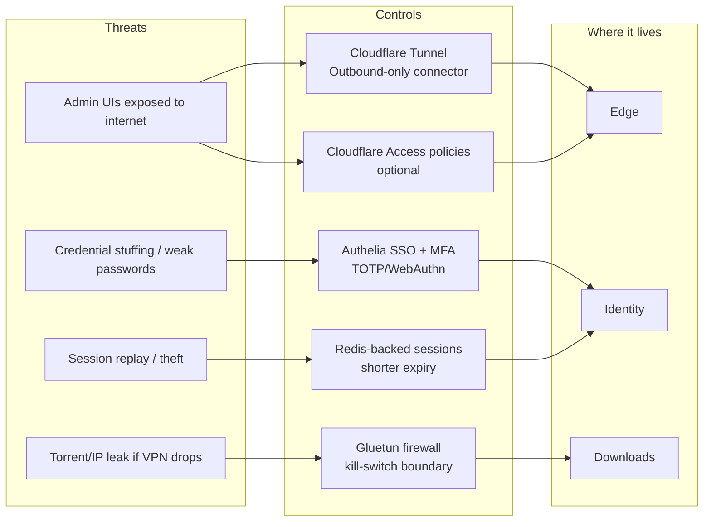
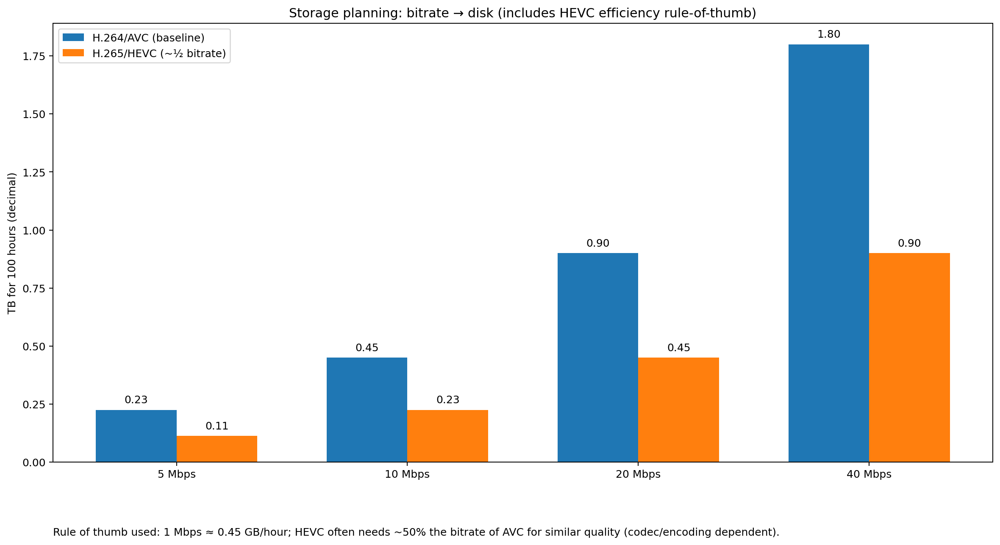

<!-- markdownlint-disable MD033 -->
<div align="center">


# 🎬 Ultimate Media Stack — GA
### Secure self‑hosted media platform with SSO/MFA, VPN‑isolated downloads, and a docs + wizard experience.

<p align="center">
  
  
  
  
  
  
</p>

<p align="center">
  <strong>Bootstrap a secure, automated Plex + Jellyfin stack with Cloudflare Zero Trust, Authelia SSO/2FA, VPN‑protected downloads (Gluetun), and a dashboard + docs site.</strong>
</p>

<p align="center">
  <a href="#-quick-start">Quick Start</a> •
  <a href="#-architecture">Architecture</a> •
  <a href="#-security-model">Security Model</a> •
  <a href="docs-site">Docs Site</a> •
  <a href="https://github.com/Morlock52/Media-stack-ga/issues">Issues</a> •
  <a href="https://github.com/Morlock52/Media-stack-ga/discussions">Discussions</a>
</p>

</div>

---

## 🔎 Table of contents

- [Quick Start](#-quick-start)
- [Stack at a glance](#-stack-at-a-glance)
- [Architecture](#-architecture)
- [Security model](#-security-model)
- [Storage planning](#-storage-planning)
- [Install & run](#-install--run)
- [Operations](#-operations)
- [References](#-references)

---

## 🚀 Quick start

### 1) Clone

```bash
git clone https://github.com/Morlock52/Media-stack-ga.git
cd Media-stack-ga
```

### 2) Configure env

```bash
cp .env.example .env
# then edit .env with your paths + secrets
```

### 3) Run the setup wizard

```bash
chmod +x setup.sh
./setup.sh
```

### 4) Start the stack

```bash
docker compose up -d
```

---

## 🧱 Stack at a glance

| Layer | What it does | Key services |
| --- | --- | --- |
| Edge / Zero‑Trust | Publishes apps without opening router ports | Cloudflare Tunnel (`cloudflared`) |
| Identity | Single sign‑on + MFA in front of routes | Authelia + Redis |
| UI / Requests | Dashboard + content requests | Homepage + Overseerr |
| Media servers | Streaming to TVs / phones | Plex + Jellyfin |
| Automation | Finds/organizes content | Sonarr + Radarr + Prowlarr + Bazarr |
| Downloads | VPN‑isolated downloads + challenge handling | Gluetun + qBittorrent + FlareSolverr |
| Ops | Visibility + updates + notifications | Portainer + Dozzle + Watchtower + Notifiarr |

> Tip: keep the table short; the long explanations live in the architecture + security sections.

---

## 🏗 Architecture

### PNG diagram (for wikis/PDFs)



### Mermaid diagram (renders natively on GitHub)

<details>
<summary><strong>Show Mermaid source</strong></summary>



</details>

---

## 🛡 Security model

### Security controls map (PNG)



### Security diagram (Mermaid)

<details>
<summary><strong>Show Mermaid security diagram</strong></summary>



</details>

### What to verify (quick checklist)

- **No inbound ports**: your router should not need 80/443 forwarded if you rely on Tunnel.
- **MFA enforced**: Authelia access policy should require 2FA for sensitive apps (Portainer, download client, etc.).
- **VPN binding**: qBittorrent should bind to the VPN network/interface so it cannot reach the internet without Gluetun.
- **Secrets**: treat `.env` and Authelia configs as sensitive; back them up safely.

---

## 💾 Storage planning



### How to use the chart

1. Pick your typical bitrate bucket (e.g., 10–20 Mbps average).
2. Estimate total watch‑hours of your library.
3. Multiply the chart value for **100 hours** by your hours / 100.

Rule of thumb used:

- **1 Mbps ≈ 0.45 GB/hour** (decimal GB)
- **HEVC/H.265 often targets similar quality at ~½ the bitrate of AVC/H.264** (codec + encoder dependent)

---

## 🧰 Install & run

### Start / stop

```bash
docker compose up -d
docker compose down
```

### Logs

```bash
docker compose logs -f
# or:
docker compose logs -f authelia
```

### Update

```bash
docker compose pull
docker compose up -d
```

---

## 🧭 Operations

### Backup priorities

- **Critical**: `.env`, `config/authelia/`, `config/cloudflared/`
- **Important**: `config/*/` (app DBs / metadata)
- **Optional**: `media/` (depends on your source of truth)

### First places to check when something breaks

- `docker compose ps`
- `docker compose logs -f cloudflared`
- `docker compose logs -f authelia`
- `docker compose logs -f gluetun`

---

## 🔗 References

These links back up the assumptions used in the diagrams & planning chart:

- Cloudflare Tunnel docs (outbound-only connector model): https://developers.cloudflare.com/cloudflare-one/networks/connectors/cloudflare-tunnel/
- Cloudflare Tunnel firewall requirements: https://developers.cloudflare.com/cloudflare-one/networks/connectors/cloudflare-tunnel/configure-tunnels/tunnel-with-firewall/
- Authelia 2FA (WebAuthn): https://www.authelia.com/configuration/second-factor/webauthn/
- Authelia 2FA (TOTP): https://www.authelia.com/configuration/second-factor/time-based-one-time-password/
- Gluetun README (built-in firewall kill-switch): https://github.com/qdm12/gluetun/blob/master/README.md
- Plex hardware-accelerated streaming requires Plex Pass: https://support.plex.tv/articles/115002178853-using-hardware-accelerated-streaming/
- Plex server sizing note (RAM): https://support.plex.tv/articles/200375666-plex-media-server-requirements/
- ITU press release (HEVC ~half the bitrate vs AVC claim): https://www.itu.int/net/pressoffice/press_releases/2013/01.aspx

