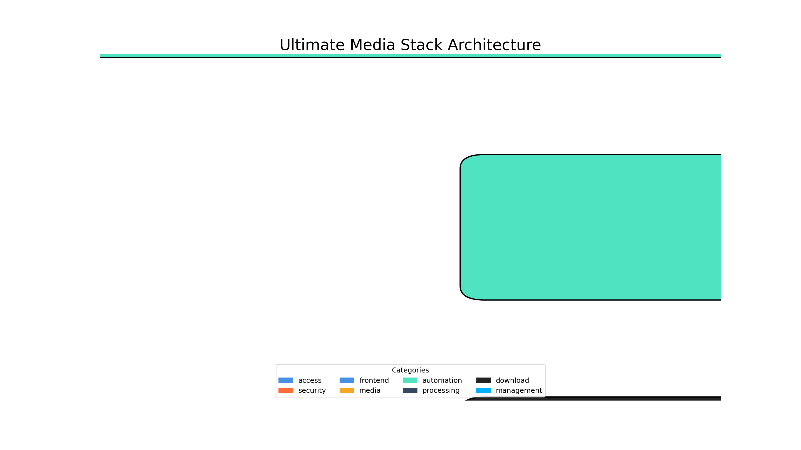
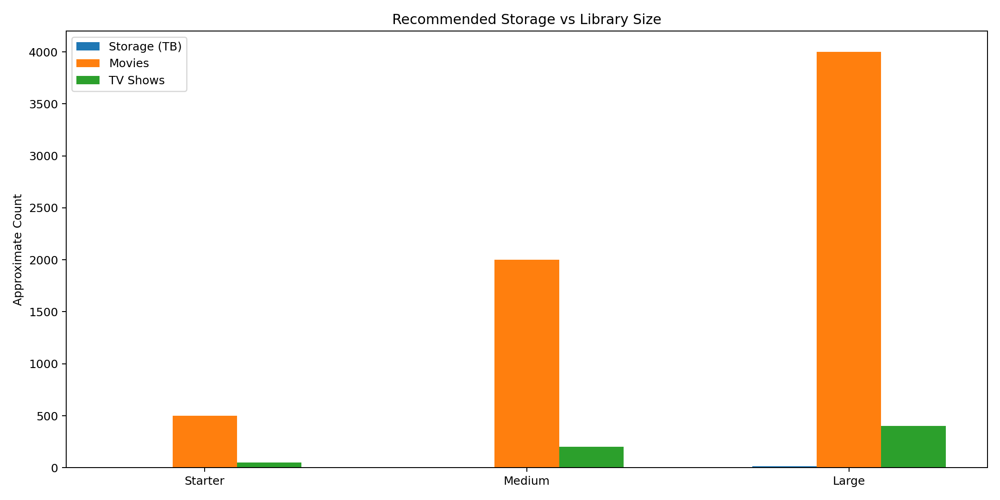

# 🎬 Ultimate Media‑Stack GA

<!-- markdownlint-disable MD013 -->

<div align="center">

### Enterprise‑grade self‑hosted media platform with zero‑trust security and AI‑powered onboarding


<p>
<strong>One repository to bootstrap a secure, automated Plex + Jellyfin stack with Cloudflare Zero Trust, Authelia SSO/2FA, VPN‑protected downloads, AI onboarding assistants, and a modern dashboard.</strong>
</p>

<p>
<a href="#-table-of-contents">Table of contents</a> ·
<a href="#-setup">Setup</a> ·
<a href="docs-site">Docs site</a> ·
<a href="https://github.com/Morlock52/Media-stack-ga/issues">Issues</a> ·
<a href="https://github.com/Morlock52/Media-stack-ga/discussions">Discussions</a> ·
<a href="#star">★ Star</a>
</p>

</div>

---

## 🔎 Table of contents

1. [Why Ultimate Media‑Stack GA?](#-why-ultimate-media-stack-ga)
2. [Stack at a glance](#-stack-at-a-glance)
3. [AI assistants](#-ai-assistants)
4. [Architecture & flow](#-architecture--flow)
5. [Storage planning](#-storage-planning)
6. [Quick start paths](#-quick-start-paths)
7. [Setup & requirements](#-setup--requirements)
8. [Installation journey](#-installation-journey)
9. [Operations & maintenance](#-operations--maintenance)
10. [Security hardening](#-security-hardening)
11. [Advanced configuration](#-advanced-configuration)
12. [Service comparison](#-service-comparison)
13. [Learn & support](#-learn--support)
14. [Contributing & license](#-contributing--license)
15. [FAQ](#-faq)

<div id="top"></div>

---

## 💡 Why Ultimate Media‑Stack GA

Self‑hosting a media server used to mean juggling dozens of containers and hoping nothing leaked onto the public internet. **Ultimate Media‑Stack GA** packages everything you need into one cohesive bundle.

- **Zero‑trust perimeter** – Cloudflare Tunnel and Authelia provide single‑sign‑on and two‑factor authentication so nothing is exposed to the open web. The tunnel itself is free to use【636714307818157†L104-L108】.
- **Dual streaming engines** – Both Plex and Jellyfin run side‑by‑side. Jellyfin is completely free and open‑source【736920552348604†L69-L70】, while Plex offers a polished experience but locks hardware transcoding and other extras behind a Plex Pass【736920552348604†L101-L106】.
- **Automated downloads** – Sonarr, Radarr and Prowlarr search for content, and qBittorrent is wrapped inside a VPN container to guarantee that all traffic stays private. Tdarr optimises your files for smooth playback.
- **AI‑guided onboarding** – Interactive TUI scripts and optional voice control ask you a few plain‑English questions and build the right stack for your hardware.
- **Cross‑platform** – Works on Windows, macOS and Linux. Minimal hardware is required: Plex Media Server typically needs only 4 GB of RAM【449177079065126†L214-L218】, though more memory helps for multitasking.

> Great READMEs use images, screenshots, badges and clear navigation【143032840745968†L259-L267】. This document follows those best practices with diagrams, charts and well‑structured sections.

---

## 🧱 Stack at a glance

| Layer | Components | Highlights |
| --- | --- | --- |
| **Access & Security** |    | Zero‑trust ingress, single sign‑on, two‑factor authentication, Argon2 secrets |
| **Media Core** |     | Plex + Jellyfin side‑by‑side; audiobook & podcast server; automated transcodes |
| **Automation & Requests** |      | Automated search & downloads, quality enforcement, subtitle fetching, user‑friendly request interface |
| **Library Extensions** |    | Comics & manga; recipe manager; AI photo organisation |
| **Downloads** |    | All torrent traffic rides a VPN tunnel; captcha bypass; kill‑switch firewall |
| **Ops & DX** |      | Auto‑discovered dashboard, GUI container management, live logs, nightly updates, notifications |

---

## 🤖 AI assistants

This stack comes with several AI‑powered helpers to streamline deployment and troubleshooting:

- **Setup Guide** — interactive coach guiding you through prerequisites, environment variables and domain configuration.
- **Dr Debug** — diagnostic agent that inspects failing containers and suggests fixes.
- **App Expert** — contextual encyclopedia for each service, accessible from the dashboard.
- **Deploy Captain** — templated commands to replicate your stack on another server or share with friends.
- **Voice Companion** — voice‑controlled wizard for screen‑free setup. Users can speak natural requests (e.g. “I have a Synology NAS and want Plex”) and receive a personalised plan.

The AI helpers live in the accompanying documentation site and rely on your own API keys. Status chips on the dashboard indicate which agent is active. A health monitor automatically surfaces failing services with remediation tips.

---

## 🏗️ Architecture & flow

Below is a high‑level overview of how components interact. The colour legend at the bottom groups services by function. External access enters through Cloudflare Tunnel and Authelia, flows into the Homepage dashboard, and then fans out to media, automation and management services. Torrent traffic is enclosed within a VPN tunnel to protect your privacy.



### Lifecycle

```
┌─────────────────────────┐      ┌──────────────────────────────┐
│ User accesses *.domain  │───▶ │ Cloudflare → Tunnel → Authelia │
└─────────────────────────┘      └──────────────────────────────┘
                    ↓ SSO/2FA passes
┌───────────────────────────────────────────────┐
│ Homepage auto‑discovers internal services    │
└───────────────────────────────────────────────┘
                    ↓ Requests sync
┌─────────────┬─────────────┬───────────────────────────────┐
│ Overseerr   │ Sonarr/Radarr │ qBittorrent → Gluetun → Tdarr │
└─────────────┴─────────────┴───────────────────────────────┘
                    ↓
┌───────────────────────────────────────────────┐
│ Plex/Jellyfin stream optimised media to users │
└───────────────────────────────────────────────┘
```

---

## 📦 Storage planning

Use the chart below to estimate how much storage you need for your library. Movies and TV series occupy vastly different amounts of space; 4K content can easily consume tens of gigabytes per file. The bar chart compares starter, medium and large libraries for approximate storage, movie counts and TV shows.



- **Starter (~2 TB)** – suits ~500 movies and ~50 TV shows, using conservative bitrates.
- **Medium (~8 TB)** – around 2,000 movies and 200 shows; enough for a small household.
- **Large (16 TB+)** – serious collectors should budget 16 TB or more for thousands of films and series.

Remember that converting files to more efficient codecs (e.g. H.265) can save 40–60% space, and adding more disks later is often cheaper than buying oversized storage upfront.

---

## 🚀 Quick start paths

Pick the installation path that matches your experience level. Each route converges on the same Docker Compose stack.

| 🎓 **Guided (Host Mode)** | 🐳 **Guided (Docker Mode)** | 🧠 **Power User** |
| --- | --- | --- |
| 1. Install Docker.<br>2. Run the interactive installer:<br>  `./setup.sh`<br>3. Launch docs site locally:<br>  `cd docs-site && npm install && npm run dev` | 1. Install Docker.<br>2. Copy `.env.example` to `.env` and set **absolute paths**.<br>3. Launch the wizard container:<br>  `docker compose -f docker-compose.wizard.yml up -d`<br>4. Open `http://localhost:3000` to configure. | 1. Skip the wizard.<br>2. Generate `.env` automatically:<br>  `./setup_auto.sh`<br>3. Run services:<br>  `docker-compose up -d`<br>4. Manage secrets via your own vault or GitOps. |

> 💡 Not sure which path to choose? Start with the guided wizard. You can always switch to manual configuration later.

---

## 🛠 Setup & requirements

Before running the stack you will need a few prerequisites:

| Requirement | Description | Free option |
| --- | --- | --- |
| 🐳 **Docker** | Container runtime for all services | ✅ Yes |
| 🐙 **Docker Compose** | Orchestration tool for multi‑container setups | ✅ Yes |
| 🌐 **Domain name** | Used for Cloudflare Tunnel and SSL | ✅ Free subdomains available |
| ☁️ **Cloudflare account** | Tunnel creation & DNS management | ✅ Free plan available |
| 🔐 **VPN credentials** | Needed for Gluetun (Mullvad, ProtonVPN, etc.) | ❌ Paid (choose your provider) |
| 🖥️ **Operating system** | Windows, macOS or Linux | ✅ All supported |

### Install Docker & Compose

<details>
<summary>🐧 <strong>Linux</strong></summary>

```bash
sudo apt update && sudo apt install docker.io docker-compose -y
sudo systemctl enable --now docker
sudo usermod -aG docker $USER
```

</details>

<details>
<summary>🍎 <strong>macOS</strong></summary>

```bash
brew install --cask docker
# or use the lightweight alternative
brew install colima docker docker-compose
colima start
```

</details>

<details>
<summary>🪟 <strong>Windows</strong></summary>

```powershell
winget install Docker.DockerDesktop
# Or using Chocolatey
choco install docker-desktop
```

</details>

Ensure that ports 80/443 are free (Cloudflare will handle ingress) and that your domain is pointing at Cloudflare. Create a Cloudflare API token with Zone → DNS (edit) and Tunnel (edit) privileges. Cloudflare’s free tier covers tunnel usage【636714307818157†L104-L108】.

---

## 🛠️ Installation journey

### 1. Clone the repository

```bash
git clone https://github.com/Morlock52/Media-stack-ga.git
cd Media-stack-ga
```

### 2. Prepare your environment

- Copy `.env.example` to `.env` if you want to customise variables manually.
- Gather VPN credentials, domain, timezone and strong master passwords.
- Stage your media directories (e.g. `/srv/mediastack/media/movies`, `C:\\mediastack\\media\\tvshows`).

### 3. Run the setup wizard

```bash
chmod +x setup.sh
./setup.sh
```

This script installs [gum](https://github.com/charmbracelet/gum) for the TUI, asks for your domain, Cloudflare token, VPN details and passwords, generates hashed secrets, prepares the directory tree and optionally pulls Docker images.

### 4. Launch the stack

```bash
docker-compose up -d
```

Monitor startup logs with `docker-compose logs -f`. The first launch may take several minutes while services initialise and download metadata.

---

## 🧭 Operations & maintenance

### Monitoring

- **Homepage** – auto‑discovered dashboard at `https://home.yourdomain.com` lists all running services.
- **Portainer** – full container management at `https://portainer.yourdomain.com`.
- **Dozzle** – live logs at `https://dozzle.yourdomain.com`.
- Command‑line basics:

```bash
docker-compose ps
docker-compose logs --tail=100 sonarr
```

### Updates

- **Automated** – Watchtower checks for image updates nightly and redeploys containers automatically.
- **Manual** – pull new images and restart:

```bash
docker-compose pull
docker-compose up -d
docker image prune -a
```

### Backups

Back up your configuration and environment file regularly. The table below lists what to prioritise.

| Priority | Path | Why |
| --- | --- | --- |
| 🔴 Critical | `config/authelia/` | Users, secrets and policies |
| 🔴 Critical | `.env` | Environment secrets and API tokens |
| 🟡 Important | `config/*/` | Application states and metadata |
| 🟢 Optional | `media/` | Replaceable if sourced elsewhere |

Sample backup script:

```bash
#!/bin/bash
DATE=$(date +%Y%m%d)
BACKUP_DIR="/path/to/backups"

tar -czf "$BACKUP_DIR/config-$DATE.tar.gz" /srv/mediastack/config
cp /srv/mediastack/.env "$BACKUP_DIR/env-$DATE.backup"
find "$BACKUP_DIR" -name "*.tar.gz" -mtime +7 -delete
```

### Troubleshooting quick cards

<details>
<summary>❌ Containers won't start</summary>

Check logs:

```bash
docker-compose logs -f <service>
```

- Look for port conflicts (`docker ps -a`).
- Fix permissions: `sudo chown -R $USER:$USER /srv/mediastack`.
- Ensure `.env` exists and is populated.

</details>

<details>
<summary>🌐 Unable to reach services through Cloudflare</summary>

- View tunnel logs: `docker-compose logs cloudflared`.
- Verify the tunnel token and credentials file.
- Map public hostnames correctly (`http://plex:32400` for Plex etc.).
- Ensure your DNS record is proxied (orange cloud).

</details>

<details>
<summary>🔒 Authelia login issues</summary>

- Inspect logs: `docker-compose logs authelia`.
- Check `users_database.yml` for correct indentation.
- Regenerate password hashes if in doubt.
- Confirm Redis connectivity (`docker-compose logs redis`).

</details>

<details>
<summary>⬇️ Downloads not using VPN</summary>

- Watch Gluetun logs for connection status.
- Test your IP inside the torrent container:

```bash
docker exec qbittorrent curl ifconfig.me
```

The output should not reveal your real IP.

- Update VPN credentials or endpoint and restart Gluetun.

</details>

---

## 🛡 Security hardening

| Checklist | Description |
| --- | --- |
| 🔑 Change default passwords | Update passwords for Authelia, qBittorrent, Overseerr and other services immediately after installation |
| ✅ Enable 2FA | Use time‑based one‑time passwords with Authelia for every account |
| 🔗 Bind torrent client to VPN | Ensure qBittorrent only uses the Gluetun interface |
| 🌐 Harden Cloudflare Access | Apply WAF rules, country‑based restrictions or hardware‑key policies on critical subdomains |
| 🔄 Rotate secrets | Periodically regenerate Authelia secrets and `.env` tokens |
| 🛡 Keep host patched | Update your OS and limit SSH access to trusted users |

Advanced users can tune session lifetimes in `config/authelia/configuration.yml`:

```yaml
session:
  expiration: 1h
  inactivity: 15m
  remember_me: 1M
```

---

## 🔧 Advanced configuration

### Custom dashboard links

The [Homepage](https://gethomepage.dev/) dashboard uses YAML files under `config/homepage/` to define cards. Add your own services like so:

```yaml
- Media:
    - My Private Service:
        icon: my-icon.png
        href: https://custom.yourdomain.com
        description: Description of my service
        widget:
          type: customapi
          url: http://custom-service:1234
```

### Notifications

Set up [Notifiarr](https://github.com/notifiarr/notifiarr) or another provider to push alerts to Discord, Telegram or your phone. Add your API key to `.env`, then configure each application’s notification settings accordingly.

### Performance tuning

- **Hardware transcoding** – Map GPU devices into the Plex container:

```yaml
plex:
  devices:
    - /dev/dri:/dev/dri  # Intel QuickSync
  # or
  runtime: nvidia
  environment:
    - NVIDIA_VISIBLE_DEVICES=all
```

- **Tdarr scaling** – To accelerate transcodes, run multiple Tdarr nodes:

```bash
docker-compose up -d --scale tdarr-node=3
```

- **Codec conversion** – Convert libraries to H.265 using Tdarr to save 40–60% space.

---

## 📊 Service comparison

| Feature | Jellyfin | Plex |
| --- | --- | --- |
| **Cost** | Always free and open‑source【736920552348604†L69-L70】 | Free tier with optional Plex Pass (£4.99/mo to £119.99 lifetime) for extras【736920552348604†L101-L106】 |
| **Mobile apps** | Native clients for Android, iOS and smart TVs | Excellent mobile apps but some features are paywalled |
| **Hardware transcoding** | Included for free【736920552348604†L69-L70】 | Requires Plex Pass【736920552348604†L101-L106】 |
| **Privacy** | Fully offline; no phone‑home services | Cloud‑connected with optional online features |
| **Plugins** | Vibrant community of third‑party plugins and themes | Limited first‑party plugin ecosystem |

The stack ships both servers by default. Try each and decide which matches your needs.

---

## 📚 Learn & support

### Documentation

- [Homepage Documentation](https://gethomepage.dev/)
- [Authelia Docs](https://www.authelia.com/docs/)
- [Sonarr Wiki](https://wiki.servarr.com/sonarr)
- [Radarr Wiki](https://wiki.servarr.com/radarr)
- [TRaSH Guides](https://trash-guides.info/)

### Communities & tutorials

- [r/selfhosted](https://reddit.com/r/selfhosted) – general self‑hosting discussion
- [r/PleX](https://reddit.com/r/PleX) – Plex‑specific tips and news
- [Jellyfin Forum](https://forum.jellyfin.org/) – help and plugin announcements
- [Servarr Discord](https://discord.gg/YQTQPZ6) – support for Sonarr/Radarr/Prowlarr

---

## 🤝 Contributing & license

Contributions are welcome! To propose a change:

1. Fork this repository.
2. Create a feature branch: `git checkout -b feature/awesome-feature`.
3. Commit your changes: `git commit -m "Add awesome feature"`.
4. Push to your fork: `git push origin feature/awesome-feature`.
5. Open a Pull Request.

By contributing you agree to license your work under the MIT license. See the [`LICENSE`](LICENSE) file for full details.

---

## ❓ FAQ

<details>
<summary><strong>Do I need a VPN provider?</strong></summary>

Yes. Gluetun expects credentials from providers like Mullvad, ProtonVPN or IVPN. It supports over 40 vendors out of the box.

</details>

<details>
<summary><strong>Can I run this without Cloudflare?</strong></summary>

Absolutely. You can replace Cloudflare Tunnel with alternatives such as Tailscale, WireGuard, Twingate or Nginx Proxy Manager. Remove the `cloudflared` service and expose ports via your preferred reverse proxy.

</details>

<details>
<summary><strong>How much hardware do I need?</strong></summary>

For a basic server, 4 cores and 8 GB of RAM with an SSD for configurations will suffice. Plex Media Server rarely needs more than 4 GB of RAM【449177079065126†L214-L218】. A dedicated GPU or CPU with QuickSync/NVENC is recommended for multiple transcodes. Raspberry Pi 4 can run the basics but will struggle with transcoding.

</details>

<details>
<summary><strong>What about storage?</strong></summary>

See the [storage planning](#-storage-planning) section. In summary: ~2 TB is enough for ~500 movies; ~8 TB for ~2,000 movies and 200 shows; ~16 TB or more for large collections. Use H.265 compression to save space.

</details>

<details>
<summary><strong>Is this legal?</strong></summary>

All software used in this stack is open‑source and legal. Use it only to manage content you own. Piracy is your responsibility and not endorsed by this project.

</details>

---

<div align="center" id="star">

### ⭐️ Enjoying the stack? Star this repo!

If this project saved you time or taught you something, consider starring the repository. It helps others discover it and encourages ongoing improvements.

[Back to top](#top)

</div>
