<!-- markdownlint-disable MD033 MD041 MD001 MD036 -->
<div align="center">


# 🎬 Ultimate Media Stack — GA

**Secure self‑hosted media platform with SSO/MFA, VPN‑isolated downloads, and a Matrix HUD wizard + docs experience**

<p align="center">
  
  
  
  
  
  
</p>

<p align="center">
  <strong>Bootstrap a secure, automated Plex + Jellyfin stack with Cloudflare Zero Trust, Authelia SSO/2FA, VPN‑protected downloads (Gluetun), and a cyber‑matrix command center UI.</strong>
</p>

<p align="center">
  <a href="#quick-start">Quick Start</a> •
  <a href="#architecture">Architecture</a> •
  <a href="#security-model">Security Model</a> •
  <a href="docs-site">Docs Site</a> •
  <a href="https://github.com/Morlock52/Media-stack-ga/issues">Issues</a> •
  <a href="https://github.com/Morlock52/Media-stack-ga/discussions">Discussions</a>
</p>

</div>

<p align="center">
  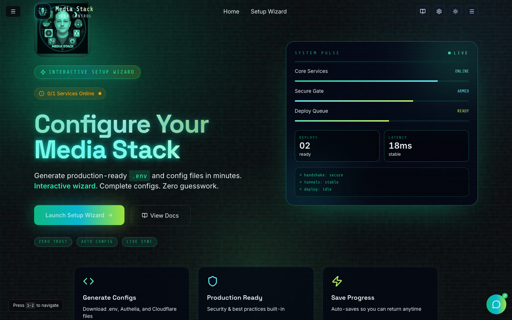
</p>

<p align="center">
  <em>Current Matrix HUD screenshots are generated via Playwright. Rebuild them with:</em>
</p>

```bash
cd docs-site && UI_REVIEW=1 npx playwright test tests/ui-review.screenshots.spec.ts --workers=1
```

```bash
python docs/scripts/render_diagrams.py
KEEP_LOGO=1 python docs/scripts/render_marketing_assets.py
```

> **Last updated:** January 4, 2026

## ✨ Screenshots (Matrix HUD)

<table align="center">
  <tr>
    <td align="center">
      
      <br /><sub><b>Dashboard</b> — zero-trust landing with app tiles</sub>
    </td>
    <td align="center">
      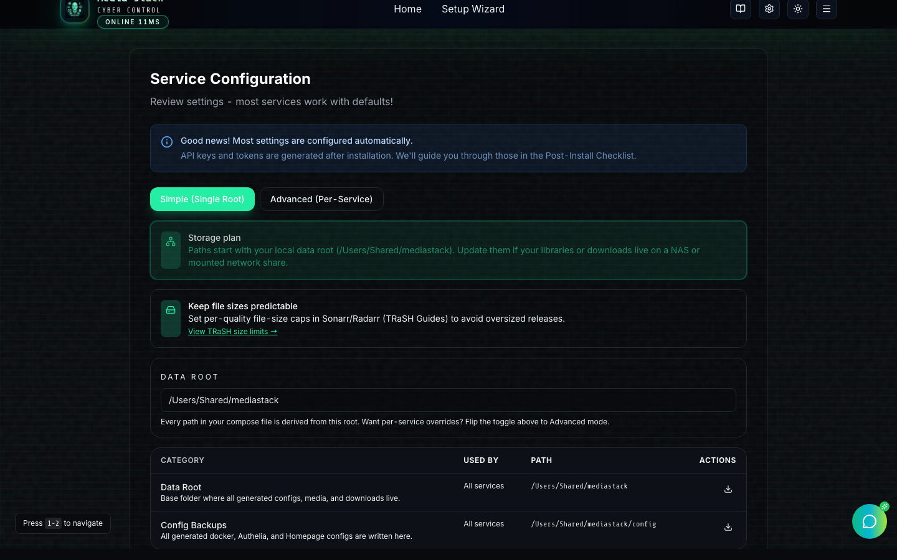
      <br /><sub><b>Service Config</b> — storage planner + per-app presets</sub>
    </td>
  </tr>
  <tr>
    <td align="center">
      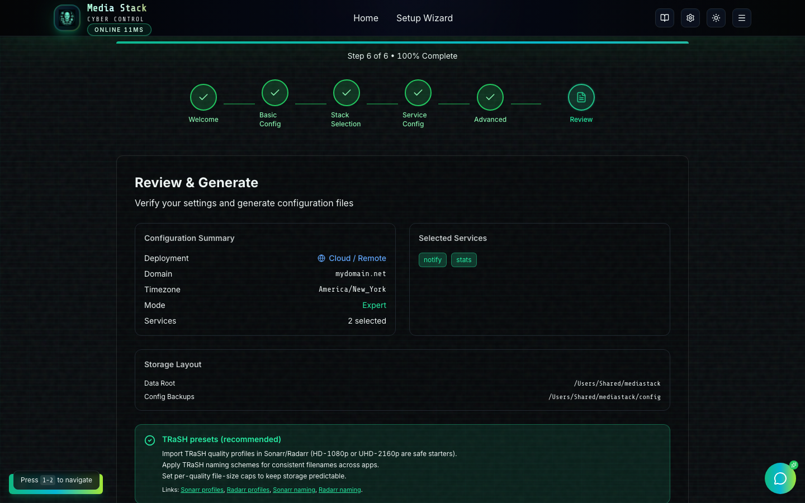
      <br /><sub><b>Review</b> — download configs, profiles ready to deploy</sub>
    </td>
    <td align="center">
      
      <br /><sub><b>Remote Deploy</b> — SSH push with health + retries</sub>
    </td>
  </tr>
  <tr>
    <td align="center">
      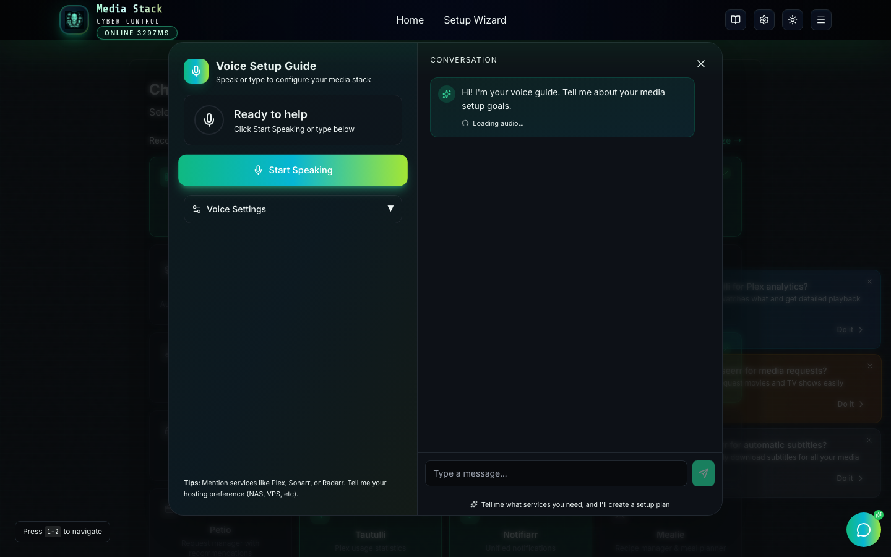
      <br /><sub><b>Voice Companion</b> — realtime mic + OpenAI TTS output</sub>
    </td>
    <td align="center">
      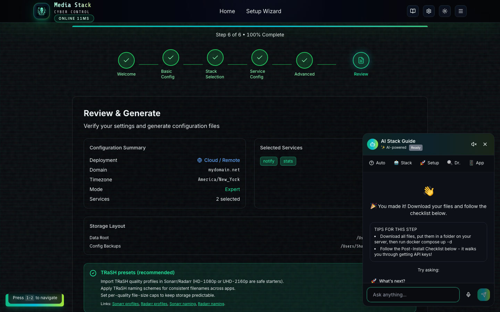
      <br /><sub><b>AI Assistant</b> — run ops, validate configs</sub>
    </td>
  </tr>
  <tr>
    <td align="center">
      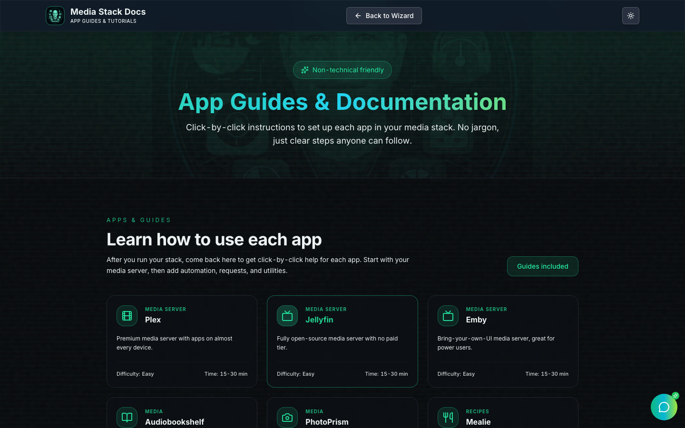
      <br /><sub><b>Docs</b> — click-by-click guides + ops checklists</sub>
    </td>
    <td align="center">
      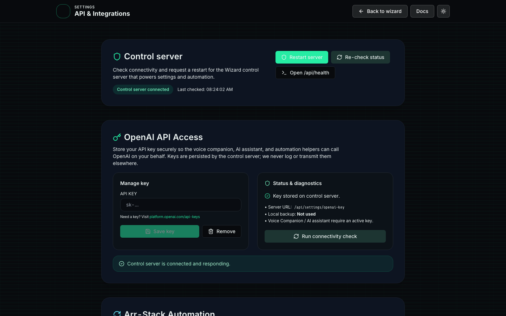
      <br /><sub><b>Settings</b> — control server URL, API keys, automation</sub>
    </td>
  </tr>
</table>

## 🔎 Table of contents

- [**Start Here — Pick Your Setup Path**](docs/getting-started/START_HERE.md) ⬅️ New? Start here!
- [**Professional Docs (Plan + Training)**](docs/pro/README.md)
- [Screenshots](#-screenshots-matrix-hud)
- [TL;DR](#-tldr)
- [Stack modes (quick map)](#-stack-modes-quick-map)
- [Docker-first install (recommended)](#-docker-first-install-recommended)
- [Quick Start](#-quick-start)
- [Local network install (LAN only)](#-local-network-install-lan-only)
- [Remote access (SSO + Cloudflare Tunnel)](#-remote-access-sso--cloudflare-tunnel)
- [Remote Deploy (SSH)](#-remote-deploy-ssh)
- [Docker + SSH control plane](#-docker--ssh-control-plane)
- [Access after remote deploy](#-access-after-remote-deploy)
- [Access modes (LAN vs Cloudflare)](#-access-modes-lan-vs-cloudflare)
- [Highlights](#-highlights)
- [Stack at a glance](#-stack-at-a-glance)
- [Agentic System](#-agentic-system)
- [Interactive Documentation](#-interactive-documentation)
- [Architecture](#-architecture)
- [Security model](#-security-model)
- [Storage planning](#-storage-planning)
- [Install & run](#-install--run)
- [Tests & stress](#-tests--stress)
- [Operations](#-operations)
- [References](#-references)

## ⚡ TL;DR (Quick Summary)

**Just want it running? Here's the fastest path:**

1. **Copy the example config:** `cp .env.example .env`
2. **Edit `.env`** and set a password for the database (look for `POSTGRES_PASSWORD`)
3. **Start the wizard:** `docker compose -f docker-compose.wizard.yml up --build -d`
4. **Open the wizard:** Go to `http://localhost:3002` in your browser
5. **Pick your apps** and click through the wizard
6. **Start your stack (pick one):**
   - **Home Network (direct ports):** `docker compose -f docker-compose.local.yml up -d`
   - **Remote Access (SSO + Tunnel):** `docker compose --profile auth --profile cloudflared up -d`
7. **Open the dashboard:**
   - **Home Network:** `http://YOUR-SERVER-IP:3000`
   - **Remote Access:** `https://hub.${DOMAIN}`

## 🧭 Which setup is right for you?

| I want to... | Use this | Difficulty |
| --- | --- | --- |
| **Stream at home only** | LAN-only install | Easy ⭐ |
| **Access from anywhere** | Remote with Cloudflare | Medium ⭐⭐ |
| **Run on a cloud server** | Remote Deploy via wizard | Medium ⭐⭐ |

## 🐳 Docker-first install (recommended)

This project is designed to run entirely in Docker. You do **not** need Node.js locally.

### 1) Clone + prep `.env`

```bash
git clone https://github.com/Morlock52/Media-stack-ga.git
cd Media-stack-ga
cp .env.example .env
```

> Notes:
> - Use **absolute paths** in `.env` when running the wizard in Docker (for example `DATA_ROOT=/srv/mediastack`). Relative paths resolve inside the container instead of your host.
> - Set `POSTGRES_USER`/`POSTGRES_PASSWORD` (required for Sonarr/Radarr/Prowlarr) and trim `COMPOSE_PROFILES` if you want to skip optional services (`transcode`, `notify`, `stats`, `mealie`, `kavita`, `audiobookshelf`, `photoprism`).
> - The observability trio (Loki/Promtail/Grafana) ships enabled; comment those services out in `docker-compose.yml` if you want a leaner stack.

### 2) Start the Wizard (Docker)

```bash
docker compose -f docker-compose.wizard.yml up --build -d
```

**Security-hardened option (recommended for production):**

```bash
docker compose -f docker-compose.wizard.secure.yml up --build -d
```

### 3) Open the Wizard UI

- `http://localhost:3002` (UI)
- `http://localhost:3001` (API, internal)
- **Tip:** In Docker wizard mode the UI proxies `/api` for you. If you host the UI elsewhere, set `VITE_CONTROL_SERVER_URL` (and optionally `VITE_CONTROL_SERVER_TOKEN`) at build time or via **Settings → Control Server Connection** so AI + remote deploy keep working.

<p align="center">
  
</p>

### 4) Generate configs + run the stack

In the wizard, complete **Service Config** → **Review & Generate**, download the files, then run the command that matches your chosen mode:

```bash
# Home Network (direct ports)
docker compose -f docker-compose.local.yml up -d

# Remote Access (SSO + Tunnel)
docker compose --profile auth --profile cloudflared up -d
```

**After deploy:** run `bash ./scripts/post_deploy_check.sh` (VPN/Auth/Tunnel) and open `http://<server-ip>:3000` (local ports) or `https://<service>.${DOMAIN}` (remote) to confirm routing.

### 5) Stop the Wizard

```bash
docker compose -f docker-compose.wizard.yml down
```

## 🚀 Quick start

Prefer the Docker-first install above. Use this path if you want the shell-driven setup.

### 1) Clone

```bash
git clone https://github.com/Morlock52/Media-stack-ga.git
cd Media-stack-ga
```

### 2) Configure env

```bash
cp .env.example .env
# then edit .env with your paths + secrets
```

> Minimum edits: set `POSTGRES_USER`/`POSTGRES_PASSWORD`, Authelia secrets, and (if remote) `CLOUDFLARE_TUNNEL_TOKEN`. Use absolute `DATA_ROOT`/`CONFIG_ROOT` paths when containers will manage Docker for you.

### 3) Run the setup wizard

```bash
chmod +x setup.sh
./setup.sh
```

### 4) Start the stack

```bash
# Pick ONE:
docker compose -f docker-compose.local.yml up -d   # Home Network (direct ports)
docker compose up -d                               # Reverse proxy stack (port 80)
```

> **Best defaults (recommended)**
> - Set a strong `POSTGRES_PASSWORD` and Authelia secrets before exposing anything remotely.
> - Use `DOMAIN=local` for LAN-only installs; use a real domain only when enabling Cloudflare Tunnel.
> - Keep `vpn` + `torrent` together so downloads never leak.
> - On Linux, start with `DATA_ROOT=/srv/mediastack` on fast storage.
> - After first boot, apply TRaSH Guides quality profiles + naming presets (HD-1080p or UHD-2160p are safe starters).

---

## 🏠 Local network install (LAN only)

**This is the simplest setup** — your media stack runs on your home network and you access it from devices in your house.

### Quick start (easiest)

1. Start the stack:

```bash
docker compose -f docker-compose.local.yml up -d
```

2. Open your browser and go to `http://YOUR-SERVER-IP:3000` (example: `http://192.168.1.100:3000`)

3. You'll see the Homepage dashboard with links to all your apps

**That's it!** Each app has its own port number. The dashboard shows you where everything is.

> Tip: In local ports mode the Homepage links are built from `DOMAIN`. Set `DOMAIN` to your server IP/hostname (example: `192.168.1.100`) so links work from other devices.

| App | How to access it |
|-----|------------------|
| Dashboard | `http://YOUR-SERVER-IP:3000` |
| Plex | `http://YOUR-SERVER-IP:32400/web/` |
| Sonarr | `http://YOUR-SERVER-IP:8989` |
| Radarr | `http://YOUR-SERVER-IP:7878` |

> 💡 **Tip:** Bookmark the dashboard — it has links to everything!

### Optional: Use friendly names (advanced)

Instead of remembering port numbers, you can set up names like `plex.local`. This requires editing your computer's hosts file or setting up a local DNS server. Skip this if you're not comfortable with it — the IP address method works fine!

> **Security reminder**
> - Change default passwords on all apps.
> - qBittorrent: default user is `admin`; the first-run password is printed in the container logs (`docker logs qbittorrent | grep -i password`).
> - If you need SSO/MFA (recommended when sharing access), use **Remote Access**: `docker compose --profile auth --profile cloudflared up -d`.

---

## 🌐 Remote access (SSO + Cloudflare Tunnel)

For internet-facing access, enable both **auth** and **cloudflared** profiles:

```bash
docker compose --profile auth --profile cloudflared up -d
```

Requires Authelia secrets + Cloudflare tunnel config in `.env`.

---

## 🛰 Remote deploy (SSH)

Remote deploy lets the wizard upload your generated `docker-compose.yml` + `.env` to a remote host over SSH and run `docker compose up -d` for you.

**Prereqs**

- The **control server** is reachable from your browser (Docker wizard mode proxies `/api`; static hosting requires `VITE_CONTROL_SERVER_URL`).
- The **remote server** has Docker + Docker Compose installed and SSH access is open.
- **Password auth** needs `sshpass` installed in the control server environment.

**Step-by-step**

1. Run the wizard and reach **Review & Generate**.
2. Click **Deploy to Server**.
3. Click **Test Connection** (validates SSH, Docker daemon, and Compose).
4. Fill in host/port/user, choose password or key auth, and confirm the deploy path.
5. (Optional) Leave **Auto‑remove conflicting containers** enabled to auto-fix container name conflicts (remove the old container and retry once).
6. (Optional) Leave **Auto-disable VPN/torrent profiles if `/dev/net/tun` is missing** enabled so the rest of the stack can still deploy on hosts without TUN support.
7. Click **Deploy** and follow the live step list.

**What to expect**

- If you click **Deploy** twice, the control server rejects the duplicate request with **HTTP 409** (“deployment already in progress”).
- After SSH connects, the deploy collects a best-effort **remote container snapshot** (name + on/off) and shows it in the UI.

**Where to check logs**

- UI shows per-step status and error details.
- Control server logs: `docker compose logs -f control-server` (or `wizard-api` in wizard mode).
- Remote host logs: `ssh <host> 'cd <deployPath> && docker compose logs -f'`

<p align="center">
  
</p>

---

## 🛰 Docker + SSH control plane

Deployment and monitoring are intentionally limited to **Docker** + **SSH** to keep the footprint small and auditable.

- Deploy to any host reachable over SSH: `ssh <user>@<host> 'cd <deployPath> && docker compose up -d'` (add profiles for auth/tunnel as needed).
- Monitor health from your terminal: `ssh <host> 'cd <deployPath> && docker compose ps'` and `ssh <host> 'cd <deployPath> && docker compose logs --tail=200'`.
- Run post-deploy validation: `ssh <host> 'cd <deployPath> && ./scripts/post_deploy_check.sh'` to verify VPN, Authelia, and Cloudflare tunnel.
- Launch the wizard via Docker only: `docker compose -f docker-compose.wizard.yml up --build -d` (use `docker-compose.wizard.secure.yml` for hardened defaults).
- Prefer SSH keys; if passwords are required for remote deploy, make sure `sshpass` is present in the control-server container.

---

## 🌐 Access after remote deploy

The deploy does **not** create DNS records or Cloudflare routes. You still need a way to reach your services:

### Option A — Domain + Cloudflare Tunnel (recommended)

1. Set `DOMAIN=example.com` and configure the Cloudflare tunnel token/command in `.env`.
2. Add DNS records or Cloudflare tunnel routes for the subdomains you want.
3. Access apps at `https://<service>.${DOMAIN}` (e.g., `https://plex.example.com`, `https://sonarr.example.com`).
4. Homepage (dashboard) is available at your root host (e.g., `https://example.com`).

### Option B — Local/LAN access (no domain)

1. Open the dashboard at `http://<server-ip>` (Traefik routes the “catch‑all” host to Homepage).
2. For direct subdomain access, add host entries on your machine:

```
<server-ip> plex.local
<server-ip> sonarr.local
<server-ip> radarr.local
```

3. Set `DOMAIN=local` to match the hostnames.

---

## 🧭 Access modes (LAN vs Cloudflare)

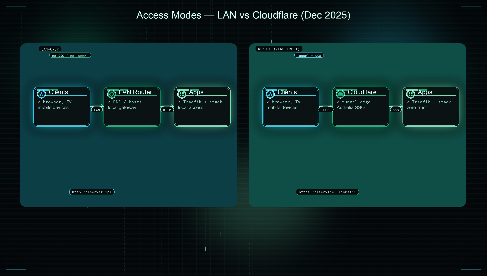

---

## ✅ Highlights

- **Matrix Wizard + Storage Planner**: Step-by-step flow with NAS-aware paths, simple/advanced storage modes, and per-service presets.
- **Postgres + Backups**: *Arr stack runs on Postgres by default with bundled `postgres-backup`; Gluetun keeps qBittorrent VPN-bound.
- **Zero-Trust Edge**: Cloudflare Tunnel + Authelia SSO/MFA sit in front of Traefik routes; LAN or internet-ready with profile toggles.
- **Observability & Recovery**: Loki/Promtail + Grafana dashboards, Dozzle/Portainer, Autoheal/Watchtower, and `scripts/post_deploy_check.sh` for VPN/Auth/Tunnel sanity.
- **AI + Voice Control**: Control server defaults to OpenAI `gpt-4o` + `gpt-4o-mini-tts`, rate-limited and tokenizable via `/api/settings/*`.
- **Interactive Docs**: Regenerable screenshots (Playwright), click-by-click guides, and exportable diagrams keep docs aligned with the shipped UI.

<details>
<summary><strong>More UI screenshots</strong></summary>

<p align="center">
  
</p>

<p align="center">
  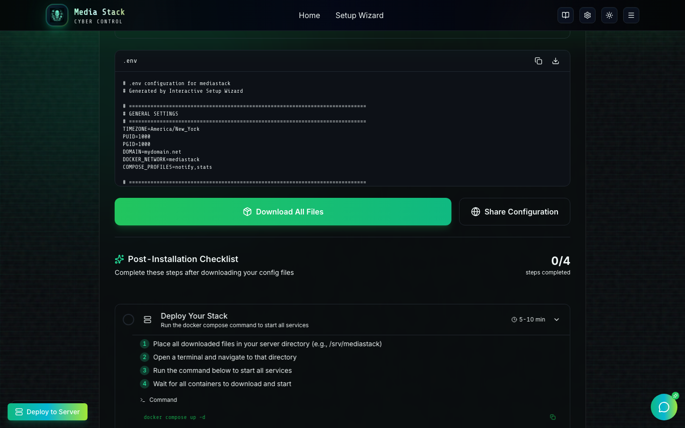
</p>

</details>

## 🤖 Agentic System

Media Stack GA features a powerful Agentic System that allows you to manage your stack through natural language and automated tools:

- **AI-powered operations**: Inspect container health, analyze logs, and run common stack commands through the control server (Docker-scoped, cached, and rate-limited).
- **Config validation**: Quick checks for `.env`, YAML, and JSON issues before you deploy, surfaced in the wizard + Settings.
- **Voice companion**: Toggle Off/Browser/OpenAI HQ output; defaults to OpenAI `gpt-4o-mini-tts` with fallback `tts-1-hd`.
- **Realtime voice**: Backed by `gpt-4o-realtime-preview-2024-12-17` with server-side VAD and error handling for smoother turn-taking.
- **Arr-stack bootstrapping**: Automatically extract and sync API keys from running Sonarr/Radarr/Prowlarr and populate the wizard.
- **Key management + guardrails**: `/settings` UI + `/api/settings/openai-key` let you persist/revoke API keys; Docker calls stay project-scoped with concurrency limits, caching, and a circuit breaker (`/api/system/status` exposes compose context + cache age, `/api/system/reload` restarts when managed by PM2/systemd).

### Remote deploy + voice quality

- **Remote Deploy** uses the control server (`/api/remote-deploy/*`) and works automatically when the UI is running behind a proxy that forwards `/api` (Docker Wizard mode does this). For static-hosted UIs, set `VITE_CONTROL_SERVER_URL` (or use Settings → “Control Server Connection”).
- If the control server is started with `CONTROL_SERVER_TOKEN`, also set `VITE_CONTROL_SERVER_TOKEN` (or enter the token in Settings) so the UI can authenticate; `/api/settings/openai-key/status` reports whether a key is stored server-side.
- Voice output defaults to OpenAI `gpt-4o-mini-tts` (fallback `tts-1-hd`, voice `coral` by default).

<p align="center">
  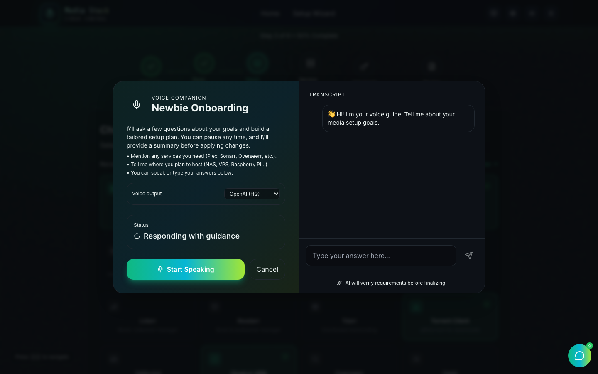
</p>

<p align="center">
  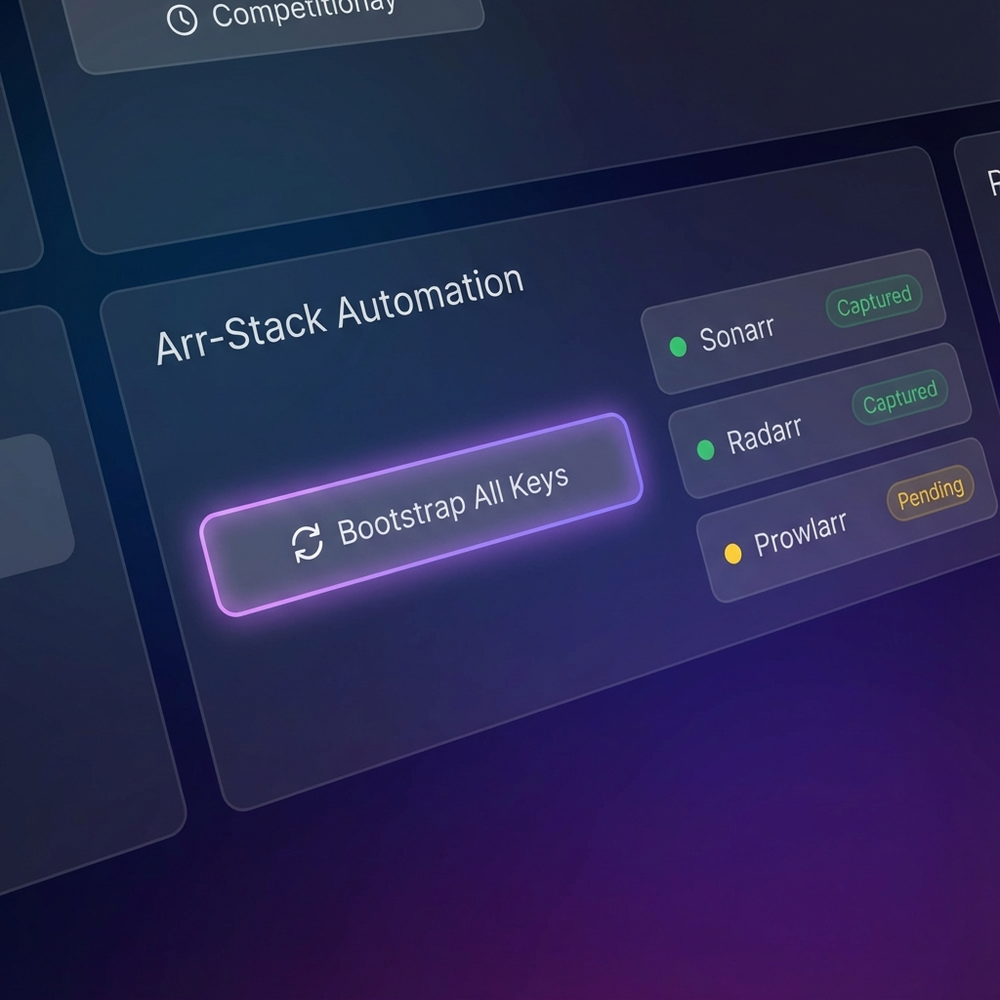
</p>

### Using the AI Assistant

You can interact with the AI Assistant to perform complex tasks:

- _"Check the logs for my download client"_
- _"Validate my updated .env file"_
- _"Bootstrap my arr stack API keys"_
- _"Why is Plex/Jellyfin not reachable behind Authelia?"_

<p align="center">
  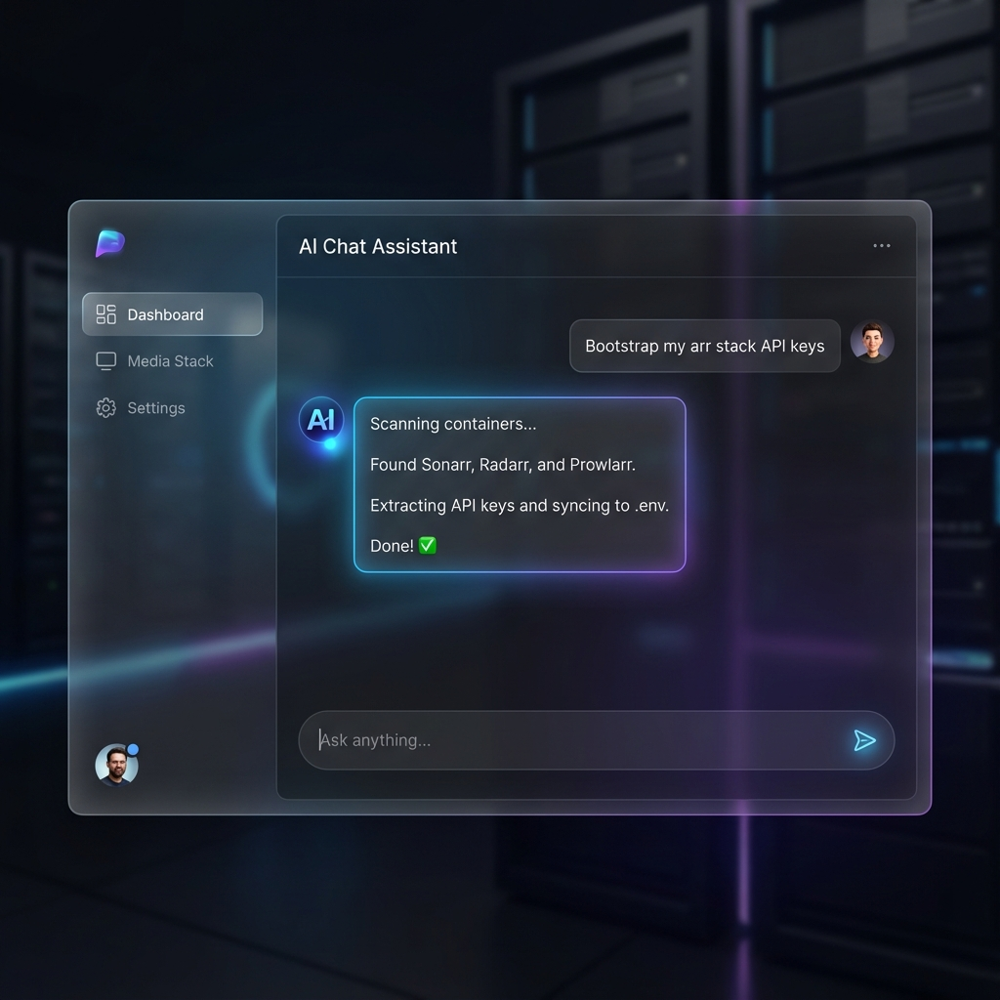
</p>

## 📖 Interactive Documentation

Media Stack includes a comprehensive documentation system that goes beyond static files. The documentation is interactive and adapts to your needs.

<p align="center">
  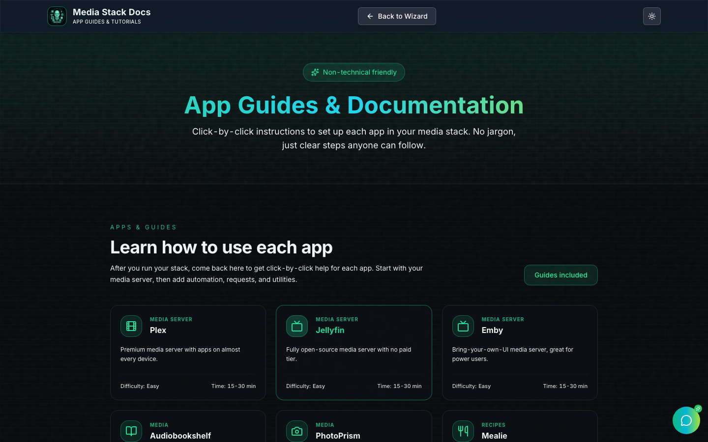
</p>

### Docs & screenshots

- Refresh UI screenshots with Playwright: `cd docs-site && UI_REVIEW=1 npx playwright test tests/ui-review.screenshots.spec.ts --workers=1`.
- Docker-only capture (no local Node needed): `docker compose -f docker-compose.wizard.yml run --rm wizard-web bash -lc "UI_REVIEW=1 npx playwright test tests/ui-review.screenshots.spec.ts --workers=1"`.
- Updated PNGs land in `docs/images/app/`; commit them with doc changes for release notes.
- To capture on a remote host, run the same commands over SSH once the repo is synced (`ssh user@host 'cd <path> && ...'`).

---

## 🧱 Stack at a glance

### Core stack

| Layer             | What it does                                | Key services                              |
| ----------------- | ------------------------------------------- | ----------------------------------------- |
| Edge / Zero‑Trust | Publishes apps without opening router ports | Cloudflare Tunnel (`cloudflared`)         |
| Identity          | Single sign‑on + MFA in front of routes     | Authelia + Redis                          |
| Data              | Durable state + backups for automation      | Postgres + `postgres-backup`              |
| UI / Requests     | Dashboard + content requests                | Homepage + Overseerr                      |
| Media servers     | Streaming to TVs / phones                   | Plex + Jellyfin                           |
| Automation        | Finds/organizes content                     | Sonarr + Radarr + Prowlarr + Bazarr       |
| Downloads         | VPN‑isolated downloads + challenge handling | Gluetun + qBittorrent + FlareSolverr      |
| Observability     | Logs/metrics dashboards                     | Loki + Promtail + Grafana (ships enabled) |

### Optional add-ons (profiles / removable)

| Add-on | Use | Notes |
| --- | --- | --- |
| Portainer | Container UI | Helpful for manual ops |
| Dozzle | Log viewer | Tail logs in-browser |
| Watchtower | Auto updates | Keep off if you want full control |
| Autoheal | Auto-restart unhealthy containers | Lightweight watchdog |
| Notifiarr | Notifications | Alerts for Plex + *Arr |
| Grafana + Loki/Promtail | Observability | Bundled by default; comment out to slim down |
| Tautulli | Plex stats | `stats` profile |
| Tdarr | Transcoding | `transcode` profile; set temp/library paths |
| Mealie | Recipes | `mealie` profile |
| Kavita | Comics/books | `kavita` profile |
| Audiobookshelf | Audiobooks/podcasts | `audiobookshelf` profile |
| PhotoPrism | Photos | `photoprism` profile |

> Trim `COMPOSE_PROFILES` (and comment out Grafana/Loki/Promtail) to keep deployments lean. Deep dives live in the architecture + security sections.

---

## 🏗 Architecture

### PNG diagram (for wikis/PDFs)

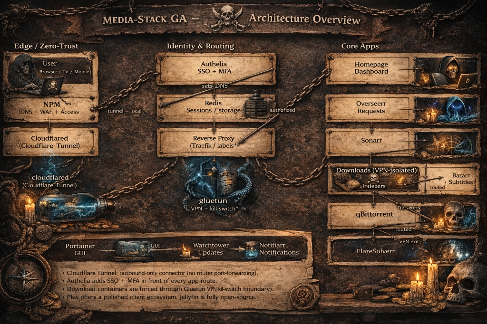

### Mermaid diagram (renders natively on GitHub)

<details>
<summary><strong>Show Mermaid source</strong></summary>

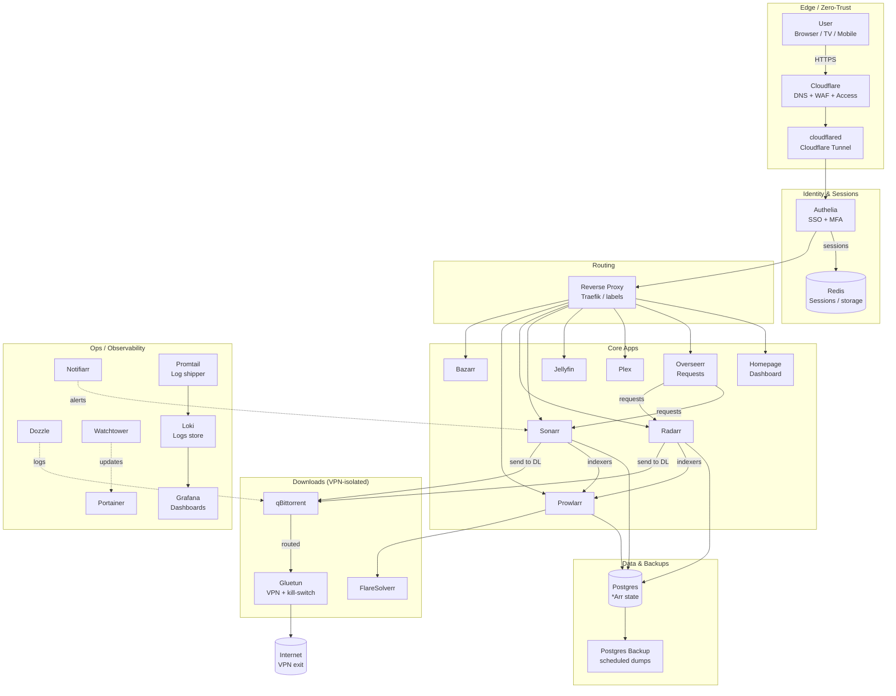
```mermaid
flowchart TB
  %% ========== Edge ==========
  subgraph Edge["Edge / Zero-Trust"]
    U["User<br/>Browser / TV / Mobile"]
    CF["Cloudflare<br/>DNS + WAF + Access"]
    T["cloudflared<br/>Cloudflare Tunnel"]
    U -->|HTTPS| CF --> T
  end

  %% ========== Identity ==========
  subgraph Identity["Identity & Sessions"]
    A["Authelia<br/>SSO + MFA"]
    R[("Redis<br/>Sessions / storage")]
    A -->|sessions| R
  end

  %% ========== Data ==========
  subgraph Data["Data & Backups"]
    DB[("Postgres<br/>*Arr state")]
    PB["Postgres Backup<br/>scheduled dumps"]
  end

  %% ========== Routing ==========
  subgraph Routing["Routing"]
    RP["Reverse Proxy<br/>Traefik / labels"]
  end

  %% ========== Apps ==========
  subgraph Apps["Core Apps"]
    H["Homepage<br/>Dashboard"]
    O["Overseerr<br/>Requests"]
    P[Plex]
    J[Jellyfin]
    S[Sonarr]
    RA[Radarr]
    PR[Prowlarr]
    B[Bazarr]
  end

  %% ========== Downloads ==========
  subgraph DL["Downloads (VPN-isolated)"]
    G["Gluetun<br/>VPN + kill-switch"]
    Q[qBittorrent]
    F[FlareSolverr]
  end

  %% ========== Ops ==========
  subgraph Ops["Ops / Observability"]
    PT[Portainer]
    DZ[Dozzle]
    WT[Watchtower]
    N[Notifiarr]
    LK["Loki<br/>Logs store"]
    PM["Promtail<br/>Log shipper"]
    GF["Grafana<br/>Dashboards"]
  end

  %% ==== Wiring ====
  T --> A --> RP
  RP --> H
  RP --> O
  RP --> P
  RP --> J
  RP --> S
  RP --> RA
  RP --> PR
  RP --> B

  S --> DB
  RA --> DB
  PR --> DB
  DB --> PB

  O -->|requests| S
  O -->|requests| RA
  S -->|indexers| PR
  RA -->|indexers| PR
  PR --> F
  S -->|send to DL| Q
  RA -->|send to DL| Q

  PM --> LK --> GF

  Q -->|routed| G
  G --> Internet[("Internet<br/>VPN exit")]

  WT -.->|updates| PT
  DZ -.->|logs| Q
  N -.->|alerts| S
```

</details>

---

## 🛡 Security model

### Security controls map (PNG)

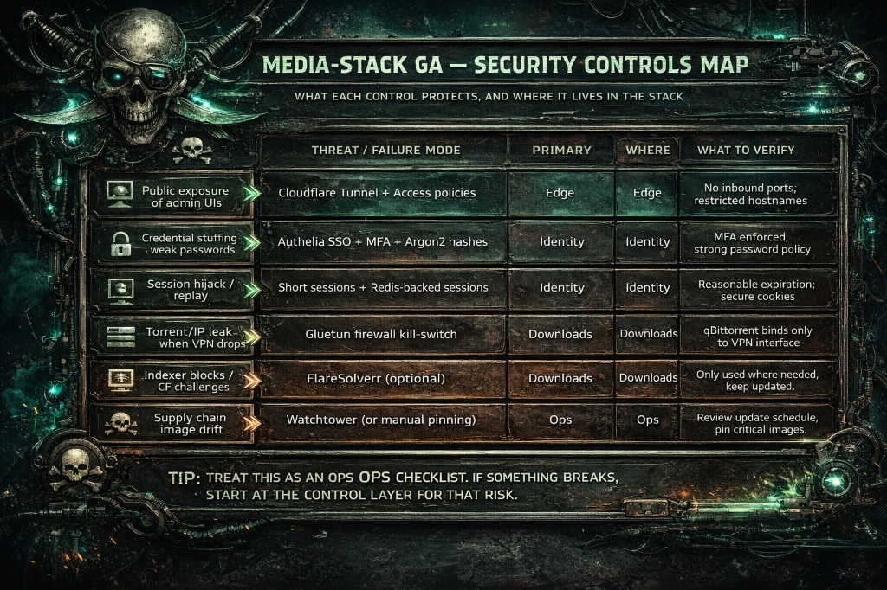

### Security diagram (Mermaid)

<details>
<summary><strong>Show Mermaid security diagram</strong></summary>

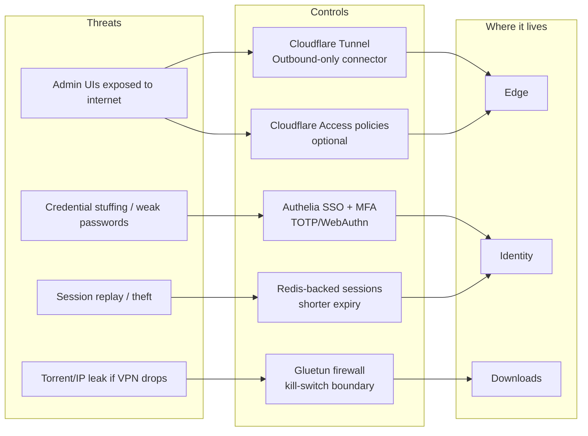
```mermaid
flowchart LR
  subgraph Threats[Threats]
    T1["Admin UIs exposed to internet"]
    T2["Credential stuffing / weak passwords"]
    T3["Session replay / theft"]
    T4["Torrent/IP leak if VPN drops"]
  end

  subgraph Controls[Controls]
    C1["Cloudflare Tunnel<br/>Outbound-only connector"]
    C2["Cloudflare Access policies<br/>optional"]
    C3["Authelia SSO + MFA<br/>TOTP/WebAuthn"]
    C4["Redis-backed sessions<br/>shorter expiry"]
    C5["Gluetun firewall<br/>kill-switch boundary"]
  end

  subgraph Where[Where it lives]
    W1["Edge"]
    W2["Identity"]
    W3["Downloads"]
  end

  T1 --> C1 --> W1
  T1 --> C2 --> W1
  T2 --> C3 --> W2
  T3 --> C4 --> W2
  T4 --> C5 --> W3
```

</details>

### What to verify (quick checklist)

- **No inbound ports**: your router should not need 80/443 forwarded if you rely on Tunnel.
- **MFA enforced**: Authelia access policy should require 2FA for sensitive apps (Portainer, download client, etc.).
- **VPN binding**: qBittorrent should bind to the VPN network/interface so it cannot reach the internet without Gluetun.
- **Secrets**: treat `.env` and Authelia configs as sensitive; back them up safely.

---

## 💾 Storage planning

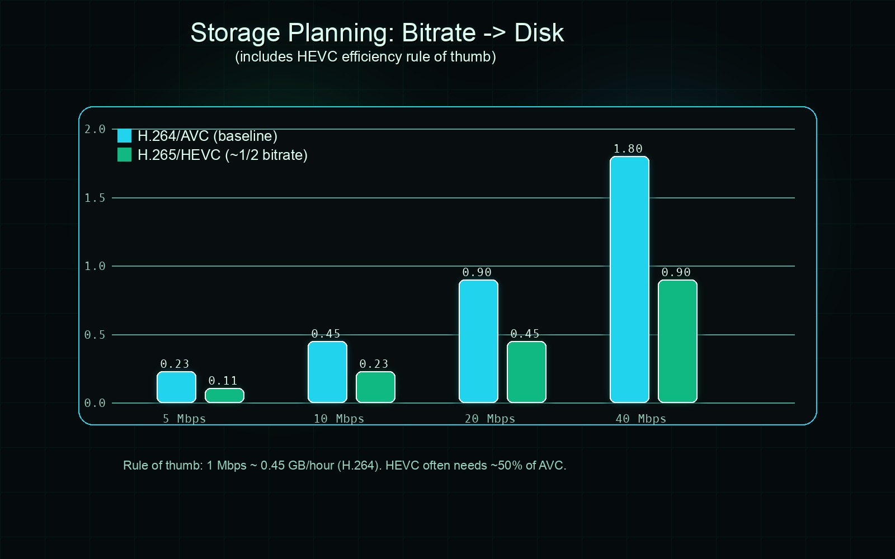

The wizard’s storage planner offers **Simple (single root)** and **Advanced (per-service)** modes, NAS/share detection, absolute-path validation, and one-click resets so your Compose paths stay coherent.

### How to use the chart

1. Pick your typical bitrate bucket (e.g., 10–20 Mbps average).
2. Estimate total watch‑hours of your library.
3. Multiply the chart value for **100 hours** by your hours / 100.

Rule of thumb used:

- **1 Mbps ≈ 0.45 GB/hour** (decimal GB)
- **HEVC/H.265 often targets similar quality at ~½ the bitrate of AVC/H.264** (codec + encoder dependent)

> For tighter storage control, apply TRaSH Guides file-size limits in Sonarr/Radarr (caps per quality tier).

---

## 🧰 Install & run

### Start / stop

```bash
docker compose up -d
docker compose down
```

### Logs

```bash
docker compose logs -f
# or:
docker compose logs -f authelia
```

### Update

```bash
./scripts/update.sh
# or, include a sanity sweep after redeploy:
RUN_POST_DEPLOY_CHECK=1 ./scripts/update.sh
```

---

## ✅ Tests & stress

```bash
npm run check        # lint + control-server tests + docs-site smoke
python scripts/check_app_docs.py  # verify docs/app.md covers compose services
npm run lint
npm test
npm run stress
```

---

## 🧭 Operations

### Backup priorities

- **Critical**: `.env`, `config/authelia/`, `config/cloudflared/`, `config/postgres/`, `config/backups/postgres/` (daily dumps)
- **Important**: `config/*/` (app DBs / metadata, including Grafana/Loki/Promtail if you keep observability)
- **Optional**: `media/` (depends on your source of truth)

### First places to check when something breaks

- `docker compose ps`
- `docker compose logs -f postgres`
- `docker compose logs -f postgres-backup`
- `docker compose logs -f cloudflared`
- `docker compose logs -f authelia`
- `docker compose logs -f gluetun`
- `curl http://127.0.0.1:3001/api/system/status` (compose context, cache age, restart hints)
- `./scripts/doctor.sh` (local diagnostics; add `--post-deploy` to chain checks)
- `./scripts/post_deploy_check.sh` (VPN/Auth/Tunnel sanity — see `docs/operations/POST_DEPLOY_CHECKS.md`)

---

## 🔗 References

These links back up the assumptions used in the diagrams & planning chart:

- [Cloudflare Tunnel docs (outbound-only connector model)](https://developers.cloudflare.com/cloudflare-one/networks/connectors/cloudflare-tunnel/)
- [Cloudflare Tunnel firewall requirements](https://developers.cloudflare.com/cloudflare-one/networks/connectors/cloudflare-tunnel/configure-tunnels/tunnel-with-firewall/)
- [Authelia 2FA (WebAuthn)](https://www.authelia.com/configuration/second-factor/webauthn/)
- [Authelia 2FA (TOTP)](https://www.authelia.com/configuration/second-factor/time-based-one-time-password/)
- [Docker Engine install](https://docs.docker.com/engine/install/)
- [Docker Compose docs](https://docs.docker.com/compose/)
- [Gluetun README (built-in firewall kill-switch)](https://github.com/qdm12/gluetun/blob/master/README.md)
- [Plex hardware-accelerated streaming requires Plex Pass](https://support.plex.tv/articles/115002178853-using-hardware-accelerated-streaming/)
- [Plex server sizing note (RAM)](https://support.plex.tv/articles/200375666-plex-media-server-requirements/)
- [ITU press release (HEVC ~half the bitrate vs AVC claim)](https://www.itu.int/net/pressoffice/press_releases/2013/01.aspx)
- [TRaSH Guides: Sonarr quality profiles](https://trash-guides.info/Sonarr/sonarr-setup-quality-profiles/)
- [TRaSH Guides: Radarr quality profiles](https://trash-guides.info/Radarr/radarr-setup-quality-profiles/)
- [TRaSH Guides: Sonarr naming scheme](https://trash-guides.info/Sonarr/Sonarr-recommended-naming-scheme/)
- [TRaSH Guides: Radarr naming scheme](https://trash-guides.info/Radarr/Radarr-recommended-naming-scheme/)
- [TRaSH Guides: Sonarr file-size limits](https://trash-guides.info/Sonarr/Sonarr-Quality-Settings-File-Size/)
- [TRaSH Guides: Radarr file-size limits](https://trash-guides.info/Radarr/Radarr-Quality-Settings-File-Size/)
