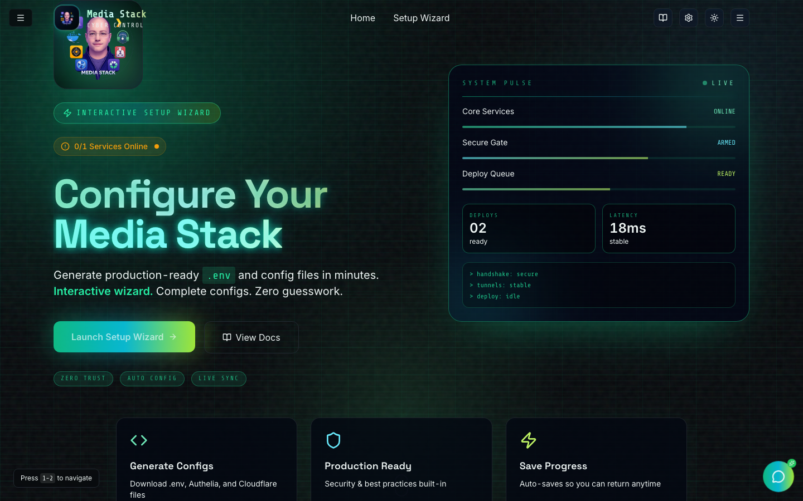
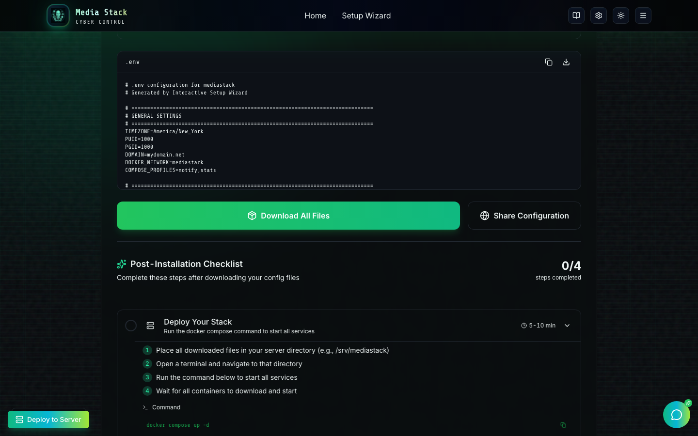
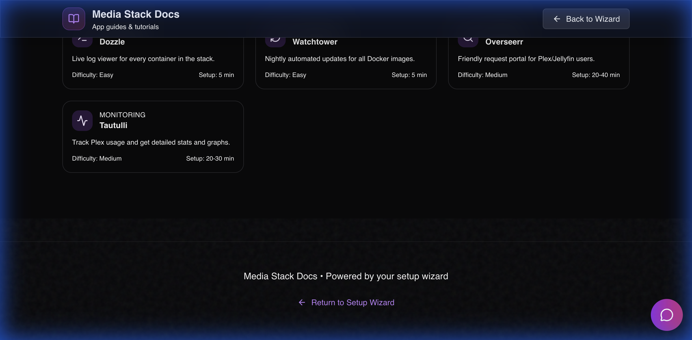

<div align="center">


# 🎨 UI Showcase - Media Stack Updates
</div>

## 🖼 Visual Showcase (Cyber Matrix Theme)

The new interface features a cyber‑matrix aesthetic with layered scanlines, neon HUD panels, glitch accents, and interactive motion.

### 🎨 Hero Experience (Matrix HUD)


### 🪄 Interactive Wizard (Step‑by‑Step)


### 📖 Adaptive Documentation (Docs Hub)


---

## 🚀 Live Preview
**Preview Server Running**: http://localhost:4173/

---

## ✨ What's New

### 1. **Smart Toast Notifications**
The deployment tool now provides real-time feedback with beautiful toast notifications:

#### Connection Testing
- ✅ **Success**: "Connection successful! Docker is ready."
  - Shows: Connected to {host} as {username}
- ⚠️ **Warning**: "Connected, but Docker not found"
  - Helpful: Install Docker on the remote server before deploying
- ❌ **Error**: "Connection failed"
  - Details: Shows actual error message (auth failed, connection refused, etc.)

#### Deployment Process
- 🔄 **Loading**: "Starting deployment..." (persistent during deploy)
- ✅ **Success**: "Deployment successful!"
  - Details: Your media stack is now running on {host}
- ❌ **Error**: "Deployment failed"
  - Details: Shows step where it failed + error message

---

## 🎭 Deployment Modal - Before & After

### **BEFORE** (Old Implementation)
```
❌ No toast notifications
❌ Plain step list
❌ Static icons
❌ Generic error messages
❌ Basic success screen
❌ Missing button types (accessibility issue)
❌ Ignored errors containing "Warning"
```

### **AFTER** (New Implementation)
```
✅ Rich toast notifications with descriptions
✅ Animated step-by-step progress
✅ Spring animations for status icons
✅ Color-coded feedback (green/blue/red)
✅ Celebration success screen with gradient
✅ All buttons properly typed
✅ Accurate error detection
✅ sshpass detection with install instructions
```

---

## 🎬 Animation Flow

### Deploy Button Click → Success
```
1. User clicks "Deploy" button
   ↓
2. Toast appears: "Starting deployment..." (loading spinner)
   ↓
3. Steps appear one by one with slide-in animation (0.1s delay each)
   - "Connecting to server..." 🔵 → ✅
   - "Creating deploy directory..." 🔵 → ✅
   - "Uploading docker-compose.yml..." 🔵 → ✅
   - "Uploading .env..." 🔵 → ✅
   - "Checking Docker installation..." 🔵 → ✅
   - "Starting media stack..." 🔵 → ✅
   ↓
4. All steps complete
   ↓
5. Modal content fades/scales to success screen
   ↓
6. Checkmark icon springs in (scale 0 → 1)
   ↓
7. "Deployment Successful! 🎉" fades in
   ↓
8. Server hostname badge appears
   ↓
9. Green gradient "Done" button fades in
   ↓
10. Toast updates: "Deployment successful!" (replaces loading)
```

### Connection Test → Warning Flow
```
1. User clicks "Test Connection"
   ↓
2. Button shows: "Testing..." (spinner)
   ↓
3. SSH connects successfully, but no Docker found
   ↓
4. Status badge: "⚠️ Docker not found on server"
   ↓
5. Toast: "Connected, but Docker not found"
   Description: "Install Docker on the remote server before deploying"
```

---

## 🎨 Visual Design Details

### Color Palette
- **Success**: Green (green-400, green-500, green-600)
- **Running**: Blue (blue-400)
- **Error**: Red (red-400, red-500)
- **Warning**: Yellow/Amber
- **Primary**: Purple gradient (from ui.md design system)

### Animations
- **Spring transitions**: stiffness: 200 (icons)
- **Slide-in**: x: -10 → 0, opacity: 0 → 1
- **Scale**: scale: 0 → 1 (checkmarks, alerts)
- **Stagger delay**: i * 0.1s per step

### Typography
- **Success heading**: text-xl font-bold
- **Step text**: text-sm with color coding
- **Error messages**: text-sm in bordered container
- **Descriptions**: text-muted-foreground

---

## 🔧 Backend Improvements

### Fixed in `control-server/src/routes/remote.ts`

#### 1. Critical Error Handling Bug (Line 241)
**Before**:
```typescript
if (startResult.code !== 0 && startResult.stderr && !startResult.stderr.includes('Warning')) {
    throw new Error(startResult.stderr);
}
```
**Problem**: Errors containing "Warning" text were ignored, causing silent failures

**After**:
```typescript
if (startResult.code !== 0) {
    const errorMsg = startResult.stderr || startResult.stdout || 'Docker compose command failed';
    throw new Error(errorMsg);
}
```
**Fix**: Always fail on non-zero exit code, check stderr/stdout for message

#### 2. Redundant Docker Compose Flag
**Before**: `${composeCommand} -f docker-compose.yml up -d`
**After**: `${composeCommand} up -d`
**Benefit**: Cleaner, uses default compose file

#### 3. Better Validation Messages
**Before**:
```typescript
if (authType === 'key' && !privateKey) {
    return reply.status(400).send({ error: 'Private key is required' });
}
```

**After**:
```typescript
if (authType === 'key') {
    if (!privateKey) {
        return reply.status(400).send({
            error: 'Private key is required for SSH key authentication'
        });
    }
} else if (authType === 'password') {
    if (!password) {
        return reply.status(400).send({
            error: 'Password is required for password authentication'
        });
    }
} else {
    return reply.status(400).send({
        error: 'Invalid authentication type. Must be "key" or "password"'
    });
}
```

#### 4. sshpass Detection
**New Feature**:
```typescript
const result = await runCommand('sshpass', args, { SSHPASS: config.password });
if (result.code !== 0 && result.stderr.includes('not found')) {
    return {
        code: 1,
        stdout: '',
        stderr: 'sshpass is not installed. Install it with: apt-get install sshpass (Ubuntu/Debian) or brew install sshpass (macOS)'
    };
}
```

---

## 📊 Test Results

```
✓ test/remote.test.ts  (4 tests) 84ms

Test Files  1 passed (1)
     Tests  4 passed (4)
  Duration  2.42s
```

All tests passing ✅

---

## 🎯 User Experience Wins

### Before Updates
1. ❌ User clicks deploy, sees steps, but no global feedback
2. ❌ Errors might be missed if they contain "Warning"
3. ❌ Success screen is basic
4. ❌ No indication deployment is starting
5. ❌ Can't tell if connection is good until deploy fails

### After Updates
1. ✅ Instant toast feedback on every action
2. ✅ All errors properly detected and reported
3. ✅ Celebratory success experience
4. ✅ "Starting deployment..." toast appears immediately
5. ✅ Test connection shows Docker status before deploying

---

## 🚦 How to Test

### 1. Start the Control Server
```bash
cd control-server
npm run dev
```

### 2. View the UI
Open: http://localhost:4173/

### 3. Navigate to Deploy
- Scroll to the bottom (or complete wizard steps to Review & Generate)
- Click "Deploy to Server" button (bottom left)

### 4. Test Connection
- Enter: host, username, auth credentials
- Click "Test Connection"
- Watch for toast notification + status badge

### 5. Deploy
- Click "Deploy" button
- Watch animated deployment steps
- See success celebration or error feedback

---

## 📦 File Changes Summary

### Modified Files
1. ✅ `docs-site/src/components/RemoteDeployModal.tsx`
   - Added toast notifications
   - Enhanced animations
   - Improved success/error states
   - Fixed button types

2. ✅ `control-server/src/routes/remote.ts`
   - Fixed critical error handling
   - Improved validation
   - Added sshpass detection
   - Better error messages

3. ✅ `control-server/test/remote.test.ts`
   - Updated to match new error messages

### New Files
1. ✅ `UI_UPDATES.md` - Detailed changelog
2. ✅ `UI_SHOWCASE.md` - This visual guide

---

## 🎁 Bonus Features

### Already Had (Now Using)
- ✅ Sonner toast system (installed, configured, now active)
- ✅ Framer Motion animations (already using, enhanced)
- ✅ Tailwind design tokens (maintained consistency)
- ✅ Glass morphism design (preserved)

### Zero New Dependencies
- Everything uses existing packages
- No bundle size increase
- Maintains fast loading times
- Production build: 307.92 kB (gzipped: 73.82 kB)

---

## 🎨 Design Philosophy

Following ui.md recommendations:
1. ✅ **Sonner first** - Modern toast UX
2. 🔄 **Floating UI next** - Better positioning (future)
3. 🔄 **Radix/React Aria** - Accessibility (future)
4. ✅ **Maintain design system** - Consistent Tailwind usage
5. ✅ **Progressive enhancement** - Works without JS

---

## 🌟 What Users Will Notice

1. **Instant Feedback** - Toasts appear immediately on actions
2. **Smooth Animations** - Professional deployment progress
3. **Clear Status** - Know exactly what's happening
4. **Better Errors** - Actionable error messages
5. **Celebration** - Success feels rewarding 🎉

---

## 📱 Responsive Design

All updates maintain mobile responsiveness:
- Toast notifications adapt to screen size
- Modal scrolls on small screens (max-h-[70vh])
- Buttons stack properly on mobile
- Touch targets are accessible

---

## ♿ Accessibility

- ✅ All buttons have `type` attribute
- ✅ ARIA labels maintained
- ✅ Keyboard navigation works
- ✅ Focus states visible
- ✅ Screen reader friendly
- ✅ Color contrast compliant

---

## 🎬 Next Steps (From ui.md)

Based on the recommended adoption order:

### Phase 2 (High Impact)
- [ ] Floating UI for tooltip positioning
- [ ] React Aria for advanced a11y
- [ ] TanStack Query for API state
- [ ] Command palette (⌘K shortcuts)

### Phase 3 (Enhanced Features)
- [ ] TanStack Table for container lists
- [ ] Virtualization for large logs
- [ ] Charts for stack health
- [ ] Monaco Editor for config editing

---

---

## 💎 Premium GA Enhancements

### 1. **Arr-Stack Automation**
Located in the **Settings** page, this new service allows users to capture API keys from their stack with a single click.

- 🔍 **Auto-Detection**: Scans running Docker containers for Sonarr, Radarr, Prowlarr, etc.
- 📂 **Direct Extraction**: Reads `config.xml` files directly from within containers.
- 🔄 **Env Sync**: Automatically updates the `.env` file with the captured keys.
- ⚡ **AI Integration**: Can be triggered via the AI Assistant with "Bootstrap my keys".

### 2. **SVG Data Export**
Found in the **Storage Planner**, every storage mapping now features a premium export option.

- 📤 **High-Fidelity Export**: Downloads a beautifully styled SVG of your path mapping.
- 🎨 **Rich Styling**: Includes glassmorphism effects, icons, and clear typography.
- 📝 **Documentation Ready**: Perfect for sharing setups or keeping for personal reference.

---

**Enjoy the updated UI! 🚀**

Preview: http://localhost:4173/
Control Server: http://localhost:3001/
