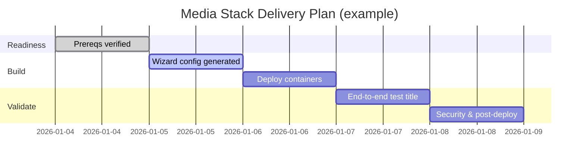

# Media Stack — Project Plan (Delivery + Ops)

## Purpose

Deploy and operate a secure, self‑hosted media stack with repeatable configuration, clear ownership, and measurable outcomes.

## Scope

**In scope**
- Deployment via Wizard (Docker) or CLI
- Two deployment modes:
  - **Home Network (direct ports):** `docker-compose.local.yml`
  - **Remote Access (SSO + Tunnel):** `docker-compose.yml` + Authelia + Cloudflare Tunnel
- Core applications shipped in `docker-compose.yml`: Plex, Jellyfin, Sonarr, Radarr, Prowlarr, Overseerr, Bazarr, qBittorrent+Gluetun, Grafana/Loki/Promtail, Portainer, Dozzle, Watchtower, Notifiarr, Tdarr, Mealie, Kavita, Audiobookshelf, PhotoPrism

**Out of scope (unless explicitly added)**
- Adding new services not present in the repo
- Building custom mobile/desktop clients
- Migrating an existing stack without downtime guarantees

## Stakeholders & Roles

- **Owner (Management):** approves remote exposure, security posture, and budgets
- **Operator (Admin):** deploys stack, maintains updates/backups, handles incidents
- **Power User (Expert):** tunes quality profiles, storage layout, and automation
- **End User (Newbie):** requests and plays media, basic troubleshooting

## Success Criteria (Definition of Done)

- Wizard completes and produces a working deployment (local or remote)
- Dashboard loads and all selected apps are reachable
- Full request → download → import → playback loop validated:
  - Overseerr request → Radarr/Sonarr → qBittorrent → library import → Plex/Jellyfin playback
- Remote access (if enabled) is protected with SSO/MFA and does not require opening router ports
- Logs/metrics visible in Grafana (basic “can I see logs?” verification)
- Operator runbook exists and post‑update checks are routine

## Deployment Decision (pick one)

| Mode | Best for | Pros | Cons |
| --- | --- | --- | --- |
| Home Network (direct ports) | LAN-only use | simplest to understand, easy troubleshooting | no SSO by default; fewer “zero trust” controls |
| Remote Access (SSO + Tunnel) | access anywhere | no inbound ports; HTTPS everywhere; SSO/MFA | more moving parts (Authelia + Cloudflare) |

## High‑Level Architecture

```mermaid
flowchart LR
  U[User Devices] -->|LAN| H[Homepage Dashboard]
  U -->|Remote| CF[Cloudflare Tunnel]
  CF -->|Hostname routes| APPS[App Containers]
  APPS --> AUT[Authelia SSO/MFA]
  APPS --> DS[Downloads: qBittorrent (+ Gluetun)]
  DS --> LIB[Media Library]
  LIB --> MS[Plex/Jellyfin]
  APPS --> OBS[Grafana/Loki/Promtail]
```

## Delivery Phases

### Phase 0 — Readiness (30–60 min)

- Confirm Docker is installed and running (Docker Desktop on macOS/Windows)
- Confirm storage location and permissions strategy (`PUID`/`PGID`)
- Decide deployment mode (local ports vs remote access)
- Confirm DNS ownership (remote access only)

**Exit criteria:** operator can run Docker and has a storage plan.

### Phase 1 — Configure (30–60 min)

- Run Wizard: `docker compose -f docker-compose.wizard.yml up --build -d`
- Complete wizard steps and download generated config
- For local ports mode:
  - Ensure `DOMAIN` is your server IP/hostname (Homepage links)
- For remote access mode:
  - Ensure Authelia secrets and Cloudflare tunnel token exist in `.env`
  - Ensure `config/cloudflared/config.yml` hostnames match `DOMAIN`

**Exit criteria:** configuration files generated and reviewed.

### Phase 2 — Deploy (15–45 min)

- Local ports: `docker compose -f docker-compose.local.yml up -d`
- Remote access: `docker compose --profile auth --profile cloudflared up -d`
- Optional: use Wizard Remote Deploy (SSH) to push to a server

**Exit criteria:** containers are up and reachable.

### Phase 3 — Application Bring‑Up (60–120 min)

- Plex/Jellyfin: claim/sign-in, create libraries
- qBittorrent: set admin password, confirm downloads path
- Prowlarr: add indexers
- Sonarr/Radarr: connect to Prowlarr + qBittorrent, set root folders
- Overseerr: connect Plex/Jellyfin + Sonarr/Radarr
- Bazarr: connect Sonarr/Radarr and enable subtitle providers

**Exit criteria:** end-to-end loop works for a test title.

### Phase 4 — Security & Reliability (30–90 min)

- Remote access: enforce SSO/MFA, confirm app URLs require authentication
- Rotate defaults: Authelia user/password, Grafana password, qBittorrent password
- Run post-deploy checks: `bash ./scripts/post_deploy_check.sh`

**Exit criteria:** remote exposure is controlled and post-deploy check passes.

### Phase 5 — Operate (ongoing)

- Weekly: check container health, disk usage, errors in Grafana
- Monthly: review users/permissions, rotate tokens, test restore steps
- After updates: run post‑deploy checks and spot-check app access

## Milestones & Timeline (example)



## Risks & Mitigations

| Risk | Impact | Mitigation |
| --- | --- | --- |
| Port conflicts (common on dev machines) | deploy fails | use local ports stack defaults; change host ports (e.g., Grafana uses `3003`) |
| No `/dev/net/tun` (VPN unavailable) | torrent/VPN fails | disable VPN/torrent profiles for that host or use a host that supports TUN |
| DNS/tunnel misconfiguration | remote access fails | verify Cloudflare ingress, use `scripts/post_deploy_check.sh`, confirm `hub.${DOMAIN}` |
| Storage path mismatch | imports fail, duplicates | use consistent mounts across *Arr + downloads + media server; validate with a test title |
| Secret sprawl | security risk | store secrets in `.env` only; rotate on schedule; never paste secrets into issues |

## Acceptance Checklist (copy/paste)

- [ ] Wizard runs at `http://localhost:3002`
- [ ] Stack starts without errors
- [ ] Homepage reachable (local: `:3000`, remote: `https://hub.${DOMAIN}`)
- [ ] Sonarr/Radarr can talk to Prowlarr
- [ ] Sonarr/Radarr can talk to qBittorrent
- [ ] Overseerr can talk to Plex/Jellyfin and to Sonarr/Radarr
- [ ] Test title completes request → download → import → playback
- [ ] Post-deploy checks pass: `bash ./scripts/post_deploy_check.sh`
