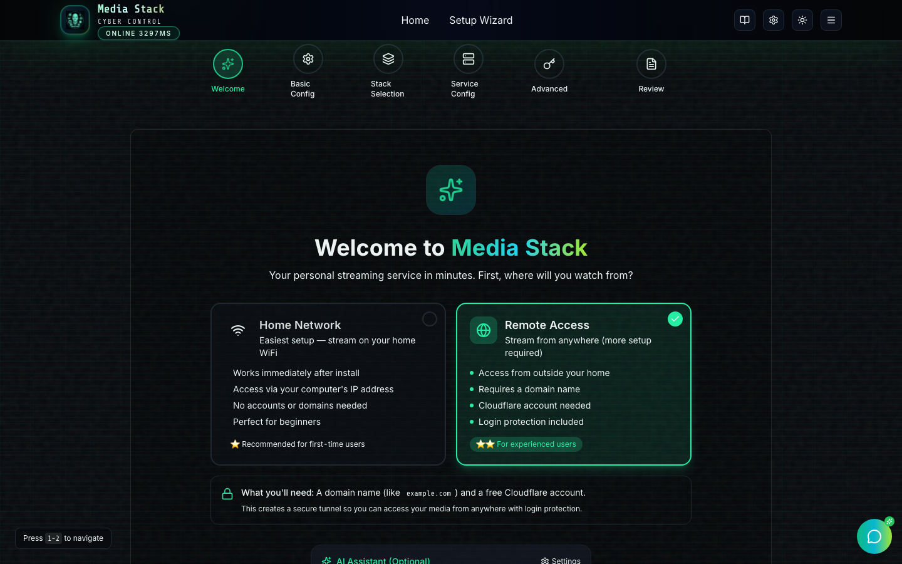
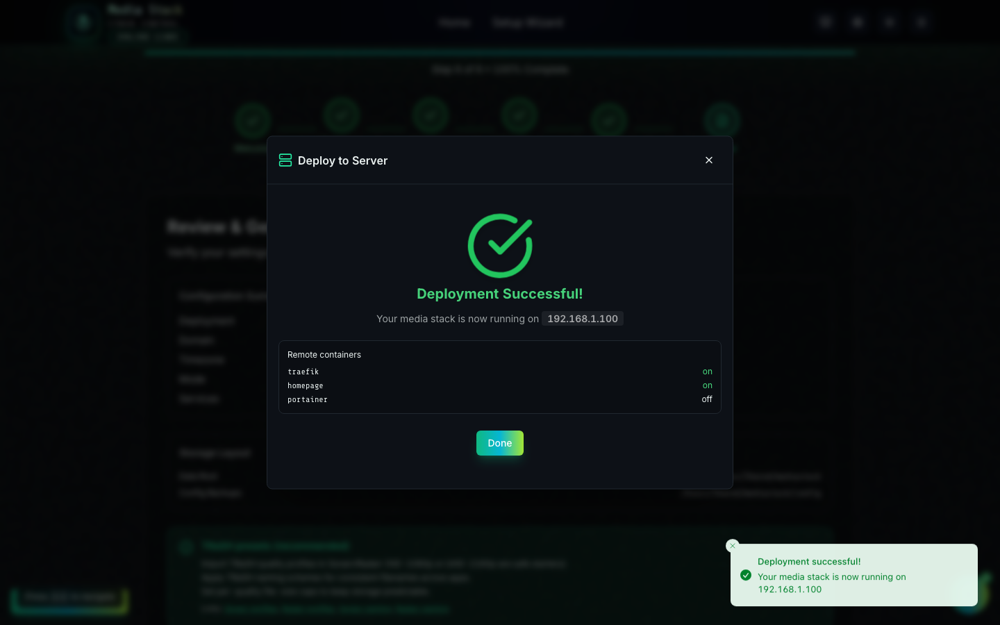

# Media Stack — Professional Docs

This folder contains stakeholder-friendly docs (project plan + training) built on top of `README.md`.

## Index

- `docs/pro/PROJECT_PLAN.md` — delivery plan, milestones, acceptance criteria
- `docs/pro/TRAINING_GUIDE.md` — end‑to‑end training (newbie → expert → management)
- `docs/getting-started/START_HERE.md` — pick your setup path (Wizard / Shell / Manual)
- `docs/getting-started/QUICK_REFERENCE.md` — commands, ports, URLs, defaults
- `docs/operations/POST_DEPLOY_CHECKS.md` — VPN/Auth/Tunnel quick checks after updates

## Quick Visuals

Wizard welcome (current UI):

Remote deploy (SSH) example:

