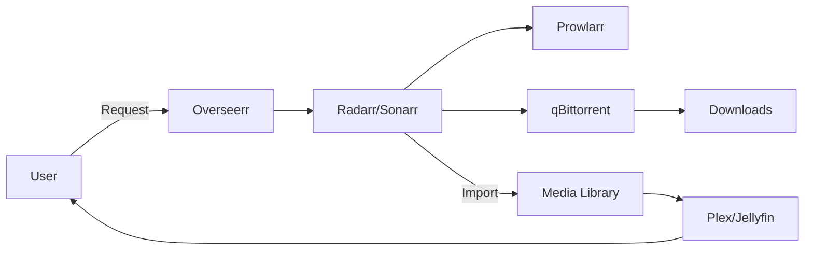
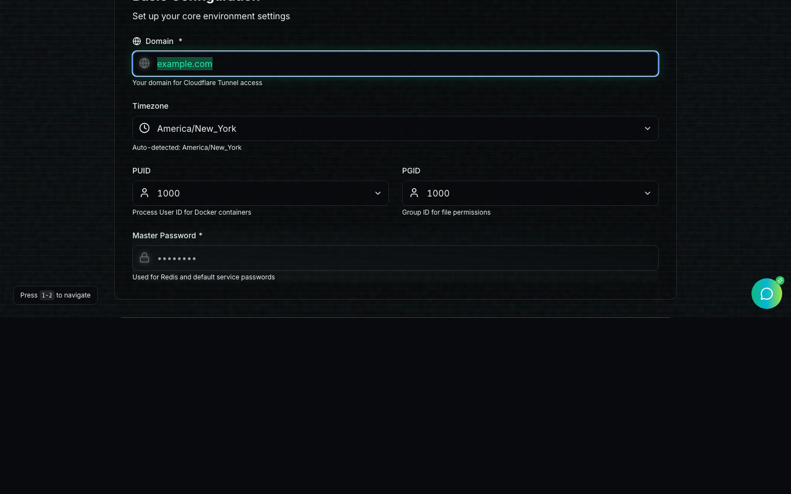
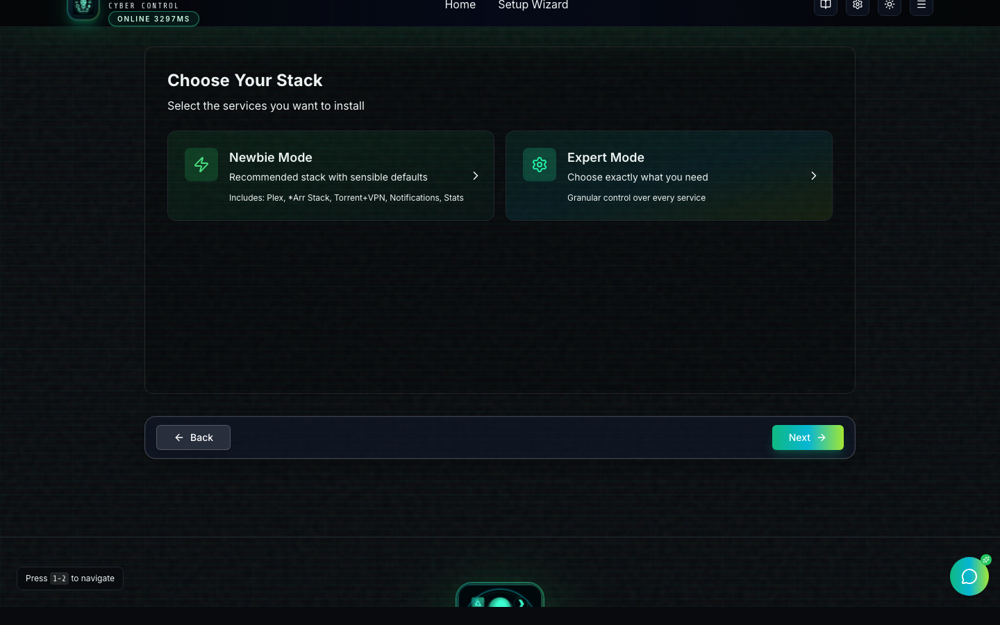

# Media Stack — Complete Training Guide

This guide is written for three audiences:

- **Newbie**: “I want it working and safe, with minimal jargon.”
- **Expert**: “I want to tune storage, automation, security, and performance.”
- **Management**: “I want the why, risks, and operating model.”

## 0) What You’re Building (Everyone)

### The value

- A self‑hosted streaming platform (Plex/Jellyfin) + automation (*Arr stack) + observability (Grafana/Loki)
- Optional secure remote access without opening router ports (Cloudflare Tunnel + Authelia SSO/MFA)

### How requests become media (high level)



### Choose your deployment mode

| Mode | When to use | What you get |
| --- | --- | --- |
| **Home Network (direct ports)** `docker-compose.local.yml` | LAN-only | simplest, each app has a port |
| **Remote Access (SSO + Tunnel)** `docker-compose.yml` | access anywhere | HTTPS + SSO/MFA + no inbound ports |

## 1) Newbie Track (60–120 minutes)

### Goals

- Deploy the stack
- Get a dashboard with working links
- Make one test request and play it

### Step 1 — Start the Wizard

```bash
cp .env.example .env
docker compose -f docker-compose.wizard.yml up --build -d
```

Open: `http://localhost:3002`


### Step 2 — Pick “Home Network” or “Remote Access”

- **Home Network**: easiest (direct ports)
- **Remote Access**: requires a domain + Cloudflare account, but is safer for internet access

### Step 3 — Fill “Basic Configuration”



Tips:
- Use a password you can store safely (password manager recommended).
- If you choose **Home Network**, set the “hostname”/`DOMAIN` to your server IP (the wizard attempts to auto‑fill this).

### Step 4 — Pick the services you want



Starter set (recommended):
- Plex or Jellyfin
- *Arr Stack (Sonarr + Radarr + Prowlarr + Overseerr + Bazarr)
- qBittorrent

### Step 5 — Review & Generate, then Deploy


Use the **Run Local Install** button (Home Network) or run the matching command:

```bash
# Home Network (direct ports)
docker compose -f docker-compose.local.yml up -d

# Remote Access (SSO + Tunnel)
docker compose --profile auth --profile cloudflared up -d
```

### Step 5a (Optional) — Remote Deploy (SSH)

If your stack runs on a separate server (NAS/VPS), you can deploy from the wizard UI:


### Step 5b (Optional) — AI Assistant & Voice

The wizard includes:
- A chat assistant for setup and troubleshooting
- A voice companion (mic input + spoken output) when an OpenAI API key is configured


Add an OpenAI API key in Settings:


Troubleshooting (Realtime voice):
- If you see "Failed to exchange SDP with OpenAI", the key may lack Realtime access, the model is blocked, or the ephemeral key expired. Re-check your key, then click **Start Speaking** again or switch to Browser/Server voice modes.

### Step 6 — Open your dashboard

- Home Network: `http://<server-ip>:3000`
- Remote Access: `https://hub.<your-domain>`

### Step 7 — Configure the basics (copy/paste checklist)

- [ ] Plex/Jellyfin: sign in, add libraries
- [ ] qBittorrent: find the first-run password in logs and change it
- [ ] Prowlarr: add at least one indexer
- [ ] Sonarr/Radarr: connect to Prowlarr + qBittorrent; set root folders
- [ ] Overseerr: connect Plex/Jellyfin + Sonarr/Radarr

## 2) Expert Track (2–6 hours)

### Goals

- Make automation reliable (imports, naming, quality profiles)
- Make security deliberate (SSO/MFA, minimal exposure)
- Make operations boring (updates, backups, monitoring)

### 2.1 Storage layout (hardlinks-friendly)

Why: a consistent `/downloads` + `/media` layout enables instant imports using hardlinks (saves space/time).

Recommended pattern (one root):

```text
/data
  /downloads
    /complete
    /incomplete
  /media
    /movies
    /tv
```

Key rule: all containers must see the same paths.

### 2.2 TRaSH Guides (quality + naming)

Use TRaSH Guides as the source of truth for quality profiles and naming:

- Sonarr: https://trash-guides.info/Sonarr/
- Radarr: https://trash-guides.info/Radarr/

### 2.3 Remote Access hardening (recommended)

Checklist:
- Cloudflare Tunnel enabled (no router ports opened)
- Authelia enabled with MFA
- Sensitive apps protected (Portainer, qBittorrent, Grafana)
- Secrets rotated and stored in a password manager

### 2.4 Observability

Grafana URL:
- Local ports: `http://<server-ip>:3003`
- Remote: `https://grafana.<your-domain>` (add ingress in `config/cloudflared/config.yml`)

Use Grafana Explore (Loki) to search for errors:

```text
{container=~"sonarr|radarr|prowlarr|qbittorrent"} |= "error"
```

### 2.5 Post‑deploy checks (after updates)

```bash
bash ./scripts/post_deploy_check.sh
```

This validates:
- VPN namespace (if enabled)
- Authelia endpoints (if enabled)
- DNS + tunnel reachability

## 3) Management Track (15–30 minutes)

### Executive summary

- The stack creates a private “Netflix‑like” experience for a household or small team.
- Remote access can be enabled without opening inbound ports (reduces attack surface).
- Operations can be standardized: updates + post‑deploy checks + backups.

### Key risks

- Misconfigured exposure (accidentally public admin surfaces)
- Weak/default passwords or leaked tokens
- Storage growth (media libraries expand quickly)

### Controls that reduce risk

- Cloudflare Tunnel + Authelia SSO/MFA for remote access
- Password manager + secret rotation cadence
- Regular update and verification workflow

### Operating model

- **Operator**: owns uptime, updates, incident response
- **Power user**: owns quality profiles and automation tuning
- **End users**: request + playback; no admin permissions

### “What success looks like”

- Users can request content and it appears automatically
- Updates are routine and do not break the stack
- A restore test is documented and repeatable

## Appendix A — Common URLs

Local ports (`docker-compose.local.yml`):
- Dashboard: `http://<server-ip>:3000`
- Plex: `http://<server-ip>:32400/web/`
- Sonarr: `http://<server-ip>:8989`
- Radarr: `http://<server-ip>:7878`
- qBittorrent: `http://<server-ip>:8081`
- Grafana: `http://<server-ip>:3003`

Remote (Cloudflare Tunnel):
- Dashboard: `https://hub.<domain>`
- Auth: `https://auth.<domain>`
- Requests: `https://request.<domain>`
- Torrents: `https://qbt.<domain>`

## Appendix B — Troubleshooting (fast)

- Wizard UI won’t load: check `docker compose -f docker-compose.wizard.yml ps` and ports `3001/3002`.
- Local stack won’t start: check for port conflicts (`lsof -i :3000 -i :3003 -i :32400`).
- Remote hostnames fail: confirm `CLOUDFLARE_TUNNEL_TOKEN` and `config/cloudflared/config.yml` hostnames.
